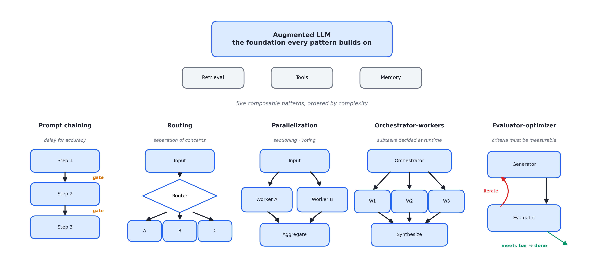
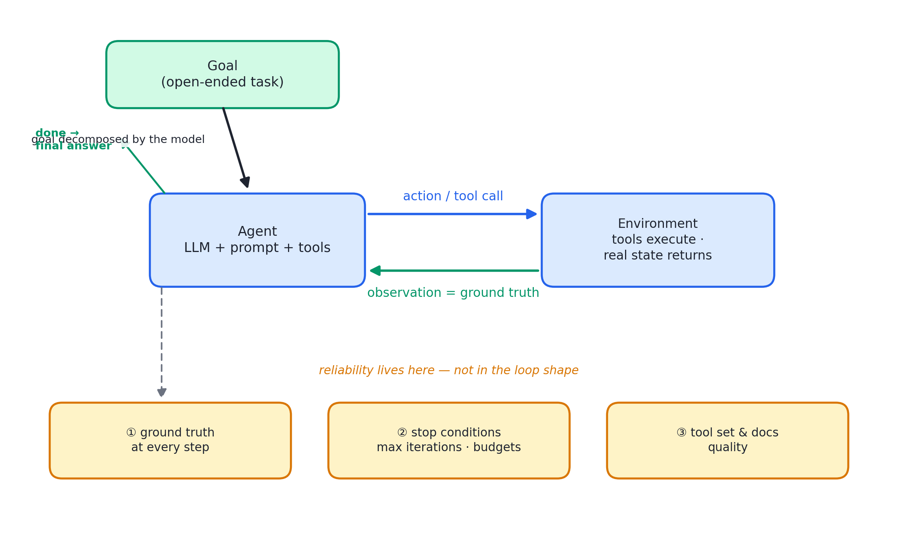

# 述评 01 | Building Effective Agents（Anthropic，2024-12）

> Schluntz, E., & Zhang, B. (2024). *Building Effective Agents*. Anthropic Engineering Blog. 全文见 [original.md](./original.md)（检索于 2026-09-12）。

## 摘要

本文系统阐述了 Anthropic 基于数十个客户团队协作与自建实践形成的智能体工程方法论。文献将全部代理式系统（agentic systems）划分为两类架构——工作流（workflow）：由预定义代码路径编排大语言模型（Large Language Model, LLM）与工具；智能体（agent）：由模型动态主导过程与工具使用——并给出以"增强型 LLM"（augmented LLM）为地基、按复杂度递增的五种可组合工作流模式。文章的核心命题是：最成功的实现依赖简单、可组合的模式而非复杂框架，复杂度只有在可证明改善结果时才应引入。两则附录分别考察客服与编码两类高价值应用场景，并提出智能体-计算机界面（Agent-Computer Interface, ACI）的工具设计准则。

## 1 文献定位与背景

本文发布于 2024 年 12 月，行业语境是智能体框架的密集涌现与概念泛化。作者的立场有意与之相反：以客户部署的第一手经验为据，主张多数应用场景根本不应构建智能体。这一立场使本文在文献群中承担"范式总纲"角色，是本辑第一组（范式总纲）的首篇——[02 号述评](../02-openai-practical-guide-building-agents/commentary.md)所评 OpenAI 指南与其构成两大实验室的总纲对照，[03 号述评](../03-anthropic-context-engineering/commentary.md)所评上下文工程文献则直接回指并简化了本文的智能体定义。

需要指出的是，原文顶部保留了 2025 年的更新注，声明文中工具生态已发生变化、产品化做法以 Managed Agents 系列为准。因此本文宜作为范式奠基文档而非产品指南阅读：其模式分类部分经受住了后续演进，具体产品引用则已部分过时。

## 2 核心命题与贡献

### 2.1 架构分界：控制权位置决定 workflow 与 agent

workflows 与 agents 的区别不在能力而在**控制权位置**，判别只需一个问题：下一步由谁决定？

- 代码路径决定 → workflow：编排逻辑置于预定义代码，可预测、一致、可审计；
- 模型决定 → agent：过程与工具使用交由模型动态主导，灵活而开放，但须以护栏与测试补偿不确定性。

这一分界随后被行业广泛采纳，构成本书第 01 章"自主性连续谱"与第 09 章"workflow/agent 判据"的直接出处。

### 2.2 增强型 LLM 地基与五种工作流模式

图 01.1 · 增强型 LLM 地基与五种可组合工作流模式，复杂度自左向右递增

检索、工具与记忆三类增强构成"增强型 LLM"，是一切组合的最小地基。文章特别将"接口对模型友好"提到与能力本身同级的地位，为后续工具设计工程学（见 04 号文献）埋下伏笔。在此地基上，文章给出按复杂度递增的五种模式，每种均附"何时使用"判据：

- **提示链（prompt chaining）**：以延迟换准确率，适用于可干净分解的固定子任务，中间可插入程序化闸门；
- **路由（routing）**：以输入分类换取关注点分离，避免"为一类输入的优化损害另一类"；
- **并行（parallelization）**：分切分（sectioning）与投票（voting）两种形态，要点是多考量任务拆给多个调用各自专注；
- **编排者-工人（orchestrator-workers）**：与并行的本质区别在于子任务由编排者依据输入**动态**决定，而非预先定义；
- **评估者-优化者（evaluator-optimizer）**：适用于评价标准清晰且迭代收益可度量的任务，实质是将人类的反馈循环内化为两个 LLM 调用之间的循环。

判据的存在使架构选择从品味问题转为工程判断。

### 2.3 智能体本体的极简性与可靠性三支柱

图 01.2 · 智能体本体：LLM 在循环中依据环境反馈使用工具；可靠性由三支柱保障，而非循环结构本身

与流行叙事相反，文中将智能体还原为"LLM 在循环中依据环境反馈使用工具"——除增强型 LLM 外不含任何新组件。可靠性的关键不在循环结构，而在三点：

- 每一步从环境获取**真实状态**（ground truth）以评估进度；
- 设置**停止条件**（如最大迭代数）以保持可控；
- **工具集与文档**的设计质量。

### 2.4 三原则与 ACI 工具设计准则

文末归纳的三原则——保持简单、显式呈现规划步骤以保透明、审慎设计工具文档与测试——构成附录 2 的纲领。ACI 概念主张以人机交互界面的投入标准对待工具设计，其操作化为四条做法：

- 设身处地评估模型视角；
- 参数命名如为初级工程师撰写文档；
- 实测模型的误用方式并迭代；
- 以防呆（poka-yoke）思路修改参数设计。

附录给出的 SWE-bench 案例具有经验说服力：将相对路径改为绝对路径后模型错误消失，作者由此报告"花在工具上的优化时间超过了 prompt 本身"。

## 3 机制与方法的评述

- **判据化是首要方法论价值**：五种模式均附适用条件，且给出反向结论（"多数应用把单次 LLM 调用配合检索与上下文示例优化好就够了"），读者可据以做排除法而非模仿式套用——这使本文区别于同时期以案例罗列为主的工程博客；
- **"框架警告"的论证结构**：框架的价值（简化低层杂务）与代价（抽象层遮蔽提示与响应、诱发过早复杂化）被并列陈述，结论是直接调用 LLM 应用程序接口（Application Programming Interface, API）起步、若用框架必须读懂底层——与本书第 06 章对抽象税的讨论相互印证；
- **对后继方法的预见**：评估者-优化者模式"评价必须可度量"的适用前提，实际上预见了后来模型裁判（LLM-as-judge）方法的判分讨论，后者在 08 号与 13 号文献中得到产品级展开。

就证据形态而言，本文属于经验性工程总结：论据来自客户部署观察与作者自身实现（SWE-bench、computer use），不含受控实验或基线数据。

## 4 局限与批判性讨论

- **观察性结论存在选择偏差风险**："最成功的实现没用复杂框架"基于作者接触的客户样本，样本构成与"成功"的定义均未披露，不宜外推为普遍规律；
- **模式边界存在过渡态**：orchestrator-workers 的编排者本身即模型动态决策，按文中"子任务是否预定义"的判据，该模式在部分预定义、部分动态的混合系统中归属不明；
- **成本与失败预算未被量化**：延迟与成本的交换仅作定性陈述，多智能体形态的 token 放大代价直到 [08 号述评](../08-anthropic-multi-agent-research-system/commentary.md)所评文献才获得 15× 量级的实测数字；
- **产品引用的时效性**：文首更新注已自我声明工具生态变化，阅读时应区分稳健的模式论述与过时的产品指涉。

## 5 与相关文献及本书的关联

在文献群内部，本文是引用网络的主要源点：02 号（OpenAI 总纲镜像）、03 号（智能体定义的再引用）、04 号（ACI 的完整方法论化）、08 号（orchestrator-workers 的产品级实现）均与其直接对话。在本书中，本文观点主要锚定于第 01、02、09 章，对应关系如下：

| 本文概念 | 本书位置 | 实战册 |
|---|---|---|
| workflows/agents 分界 | 第 01、09 章 | stage06 的确认门正是"把控制权收回代码" |
| 五种模式 | 第 09 章五种积木、第 16 章编排 | stage05 并行 subagent |
| routing | 第 26 章强弱模型路由 | stage11 裁判分流思想 |
| evaluator-optimizer | 第 20、22 章模型裁判 | stage11 eval harness |
| agent loop + 停止条件 | 第 02、21 章 | stage01、stage06 |
| ACI / 工具文档 | 第 11 章工具军规、04 号文献 | stage03 schema 校验 |
| 客服/编码场景 | 第 05、08 章 | stage11 评测用例即客服域 |
