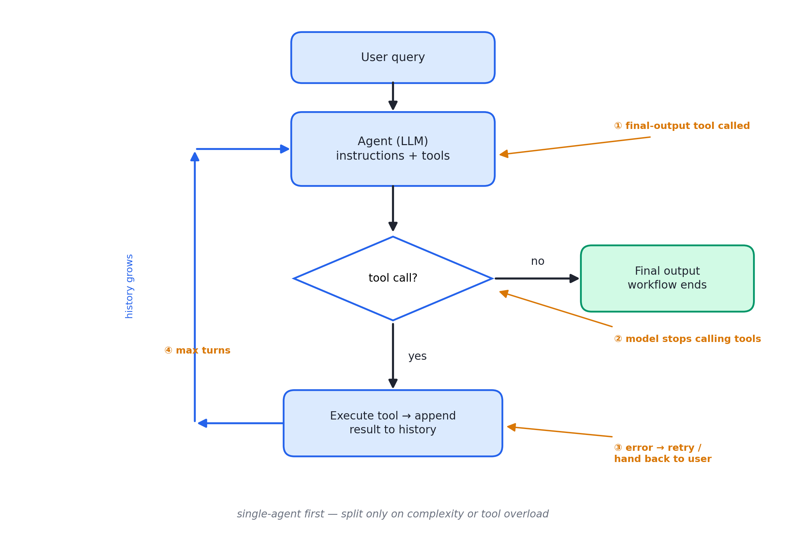
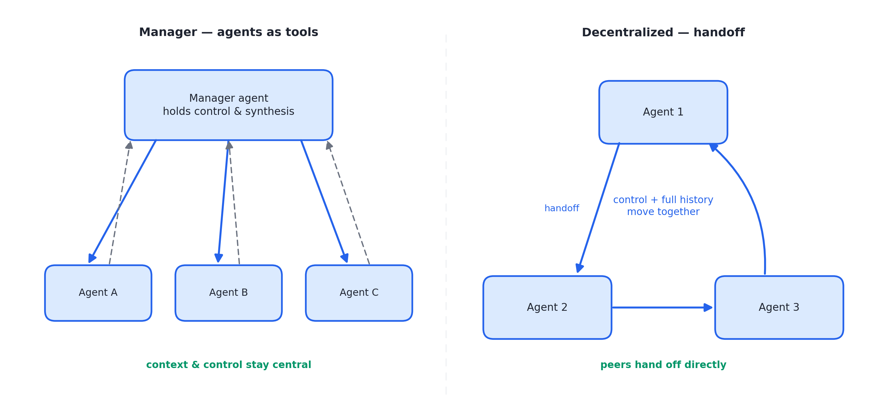
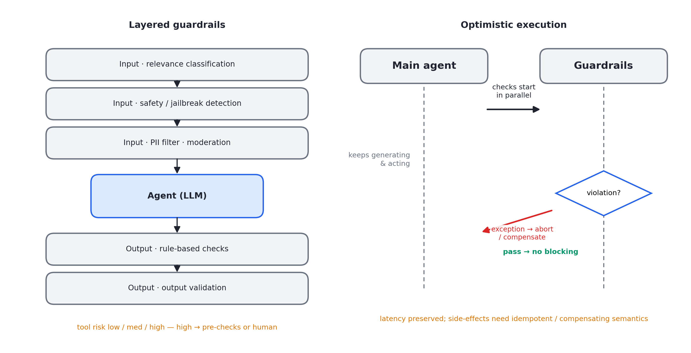

# 述评 02 | A Practical Guide to Building Agents（OpenAI，2025-01）

> OpenAI (2025). *A Practical Guide to Building Agents*. OpenAI Business Guides. 全文见 [original.md](./original.md)（检索于 2026-09-12；本档案为官方 34 页 PDF 的文本提取版）。

## 摘要

本指南面向首次构建智能体的产品与工程团队，系统给出用例甄别、系统设计、编排与护栏四个层面的实践框架。文献将智能体定义为"独立代表用户完成任务的系统"，由模型、工具与指令三要素构成；在编排上主张单智能体优先、按需演进至 Manager 与 Decentralized 两类多智能体形态；在安全上提出分层护栏防御与人在环（Human-in-the-Loop, HITL）干预机制。与学术文献不同，本文以决策清单和基于软件开发工具包（Software Development Kit, SDK）的代码示例为载体，属于企业工程指南体裁。

## 1 文献定位与背景

本文发布于 2025 年 1 月，属 OpenAI 业务指南（Business Guides）系列，内容为大量客户部署经验的提炼。与 [01 号述评](../01-anthropic-building-effective-agents/commentary.md)所评文献构成镜像：二者在"最简单方案优先"上完全同调，但体裁与侧重不同——Anthropic 文本为工程博客体，面向机制论述；本文为企业指南体，面向落地决策，配有判据清单与代码示例。

值得注意的是，本文发布后在社区引发争议，LangChain 创始人 Harrison Chase 公开批评其中部分观点（尤其单智能体优先）过于保守。这一争议本身具有文献价值：它标示出本文判据体系的适用域——面向有清晰成功标准的业务工作流，而非开放式研究任务。在文献群中，本文是 OpenAI 系叙事的起点，[10 号述评](../10-openai-orchestrating-agents/commentary.md)所评 Routines & Handoffs 文献与 [11 号述评](../11-openai-agents-sdk/commentary.md)所评 Agents SDK 概念文档均可在本文找到原型。

## 2 核心命题与贡献

### 2.1 定义与三要素

文章以"工作流是为达成用户目标必须执行的步骤序列"为定义起点，将智能体界定为具备两项核心特征的系统：

- 由大语言模型（Large Language Model, LLM）管理工作流执行并做决策——识别任务完成、主动纠正错误、失败时将控制权交还用户；
- 在明确定义的护栏内，依据工作流状态动态选择工具。

模型、工具与指令三要素由此构成系统的全部。

### 2.2 用例判据：何时不该用智能体

三项判据刻画智能体的适用域，判据不满足时应采用确定性方案：

- **复杂决策**：涉及细微判断、例外与上下文敏感的决策，如退款审批；
- **规则难维护**：规则集臃肿至更新成本高、易出错；
- **重度依赖非结构化数据**：自然语言理解、文档解析、对话式交互。

支付欺诈分析的隐喻准确传达了立场：规则引擎如清单，智能体如老练的调查员——后者能在不违反明文规则时识别可疑模式。

### 2.3 模型选型、工具三分类与指令工程

- **选型三原则**：先建立评测基线；以最强模型达成准确率目标；再以小模型替换以优化成本与延迟。这一"先强后弱"顺序的工程含义在于：先确认能力上界，再谈经济学，使成本优化始终有评测背书。
- **工具三分类**：数据（Data）类用于获取上下文；动作（Action）类用于执行变更；编排（Orchestration）类指"智能体本身可作为其他智能体的工具"——直接为 Manager 模式埋下伏笔。工具应标准化定义、充分文档化、可复用，以支持工具与智能体间的多对多关系。
- **指令工程四实践**：复用既有标准作业程序（Standard Operating Procedure, SOP）与知识库文档；将稠密资源拆为小步骤；每一步对应明确动作（乃至用户话术）；覆盖边界情况（信息缺失时的条件分支）。文章还给出以高级模型从帮助中心文档自动生成指令的模板，属于"提示的工业化生产"思路。

### 2.4 单智能体编排与拆分判据

图 02.1 · 单智能体 run loop：增量加工具地扩展能力，四类退出条件终止循环

单智能体优先：先以增量加工具的方式扩展能力，run loop 的退出条件有四：

1. 调用最终输出工具；
2. 模型不再调用工具；
3. 出错；
4. 达到最大轮数。

复杂度管理依赖提示模板变量化（单一基础模板加策略变量）。拆分判据有二：复杂逻辑（条件分支多至模板难以维护）与工具过载——关键不是工具数量而是相似度，"15 个边界清晰的工具"可以优于"10 个相互重叠的工具"。

### 2.5 多智能体两型：Manager 与 Decentralized

图 02.2 · 两类多智能体拓扑：Manager 型控制权与上下文居中，Decentralized 型随移交转移

- **Manager 型（agents as tools）**：中央管理者经工具调用协调专职智能体，保留控制与综合；
- **Decentralized 型（handoff）**：智能体平权移交，handoff 是携带最新对话状态的单向控制权转移。

文章另陈述了声明式图与代码优先两种框架观的差异。

### 2.6 分层护栏、乐观执行与人在环

图 02.3 · 左：输入侧与输出侧的分层护栏；右：护栏并行检查的乐观执行时序

护栏类型覆盖六类：相关性分类、安全分类（越狱与注入检测）、个人身份信息（Personally Identifiable Information, PII）过滤、内容审核、规则防线与输出校验。工具按读写性、可逆性、权限与资金影响评定低中高三级风险，高危动作触发先决检查或转人工。

架构层面的亮点是**乐观执行**（optimistic execution）：主智能体先行生成，护栏并行检查，违约即抛出异常——护栏不阻塞主流程延迟。人在环设两触发器：失败阈值超限（多次重试仍无法理解意图）与高风险动作（敏感、不可逆、高代价的操作，如取消订单、大额退款、支付）。

## 3 机制与方法的评述

- **排除条件清单是首要贡献**：把"何时不该用智能体"写成可操作的清单，企业评审可直接采用；三判据本质上是规则系统失效信号的条目化；
- **"先强后弱"的选型顺序**：使成本优化具有评测背书，避免过早为模型能力设限，这一路径与本书第 26 章成本路由的实操前置一致；
- **乐观执行是延迟与安全之间的折中设计**：护栏并行化保住了主流程延迟，但其隐含代价——违规动作可能已产生部分副作用——需要补偿或幂等语义兜底，原文未讨论此点；
- **概念的产品化前奏**：handoff 的形式化（工具调用加状态转移）是 11 号文献中 Handoff 原语的接口雏形；工具风险三级评级则是分级授权思路的早期表述。

## 4 局限与批判性讨论

- **供应商语境**：全部示例绑定 Agents SDK 与 OpenAI 模型生态；对声明式图框架（未点名，显指 LangGraph 一类）的评述单方面呈现其笨重一面，未讨论显式图在可视化治理与审计场景的价值；
- **评测方法学被设定为前提而未展开**：基线如何建立、判分与回归如何设计在本文缺位，后由 08 号与 13 号文献补足；
- **多智能体的经济维度缺位**：Manager 与 Decentralized 形态的 token 与延迟代价未量化（对照 [08 号述评](../08-anthropic-multi-agent-research-system/commentary.md)所评文献的 15× 实测），"何时拆分"的判据因此少了成本一侧；
- **适用域边界**：判据体系面向业务工作流，对开放式、探索型任务的解释力有限，须以 01、12、14 号文献补充；
- **乐观执行与高风险金融动作的组合风险未被讨论**。

## 5 与相关文献及本书的关联

在文献群内部，01 号与其同调互镜，10 号延伸其编排章节，11 号将 Manager、Handoff、Guardrail 等概念产品化为五原语，08 号则从多智能体收益实证的相反立场提供对照。在本书中，本文观点主要锚定于第 01、07、16、21、23、26 章：

| 本文概念 | 本书位置 | 实战册 |
|---|---|---|
| 三要素（模型/工具/指令） | 第 01、21 章（七层的 L1/L3/L2） | stage12 分层同构 |
| 单 agent run loop + 退出条件 | 第 02、21 章 | stage01/06 max_turns |
| Manager / Decentralized | 第 07、16 章 | stage05 fan-in |
| 工具风险分级 + 人在环 | 第 23 章 | stage06 确认门、stage07 权限 |
| 分层护栏、乐观执行 | 第 23 章四级防线 | stage07 |
| 先强后弱选型 | 第 26 章成本路由 | stage11 程序判分+裁判 |
