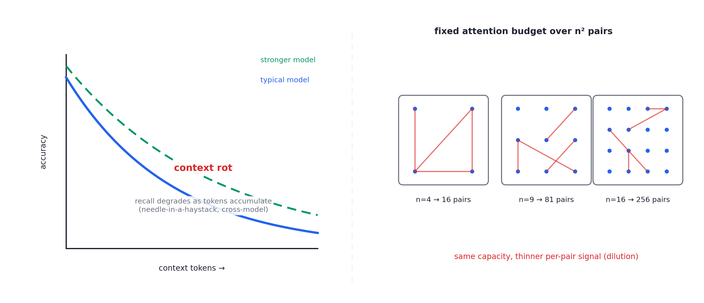
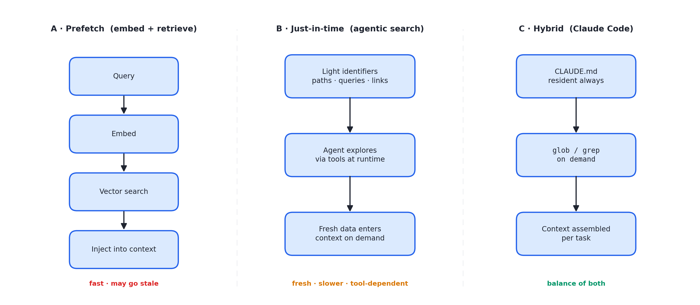
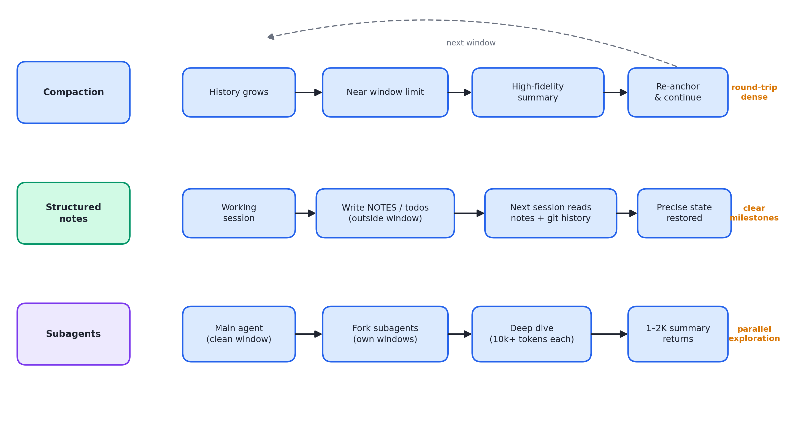

# 述评 03 | Effective Context Engineering for AI Agents（Anthropic，2025-09）

> Rajasekaran, P., Dixon, E., Ryan, C., & Hadfield, J. (2025). *Effective Context Engineering for AI Agents*. Anthropic Engineering Blog. 全文见 [original.md](./original.md)（检索于 2026-09-12）。

## 摘要

本文将"上下文工程"确立为提示工程（prompt engineering）在智能体时代的后继框架。文献以"注意力预算"（attention budget）解释长上下文下的性能退化，引用 context rot 的实证结果说明召回精度随上下文中 token 数的增长而下降；进而将工程目标形式化为"寻找能最大化期望行为概率的最小高信号 token 集合"，并就系统提示、工具与示例三类上下文组件给出准则。针对任务时长超出上下文窗口的情形，文章提出压缩（compaction）、结构化笔记（agentic memory）与 subagent 架构三种互补策略，并附选型判据。

## 1 文献定位与背景

本文发布于 2025 年 9 月，出自 Anthropic 应用 AI 团队，与 Sonnet 4.5 发布及官方 memory/context management 工具上线同期。文章开篇即厘清术语谱系：提示工程关注"如何书写与组织指令"，上下文工程关注"推理时刻进入模型窗口的全部 token 如何策划"——后者涵盖系统指令、工具定义、模型上下文协议（Model Context Protocol, MCP）接入、外部数据与消息历史的整体状态管理。

在文献群中，本文是第二组（上下文、工具与技能）的首篇，处于枢纽位置：它回指 [01 号述评](../01-anthropic-building-effective-agents/commentary.md)所评文献的智能体定义并采纳 Simon Willison 的简化表述（"大语言模型（Large Language Model, LLM）在循环中自主使用工具"），其长时程三技术则构成 [12 号述评](../12-anthropic-effective-harnesses/commentary.md)、[13 号述评](../13-anthropic-harness-design-long-running-apps/commentary.md)与 [14 号述评](../14-openai-harness-engineering/commentary.md)所评长时程文献的共同前提。

## 2 核心命题与贡献

### 2.1 注意力预算与 context rot

图 03.1 · 左：召回精度随上下文 token 数增长而退化（context rot）；右：注意力预算在 n² 两两关系中被稀释

针对孔在草堆（needle-in-a-haystack）类基准的研究表明，随上下文 token 数增加，模型准确召回信息的能力下降，且该特性跨模型普遍存在。文章将其根源归结为两条架构约束：

- LLM 的注意力机制对 n 个 token 形成 n² 两两关系，上下文越长该关系越被稀释；
- 训练分布中短序列占多数，模型对长程依赖缺乏专门参数。

由此得出的工程结论是：**上下文是边际收益递减的稀缺资源**，性能呈梯度下降而非硬悬崖。

### 2.2 目标形式化与系统提示的正确高度

"寻找能最大化期望行为概率的、最小的、高信号 token 集合"是全文总纲，三类组件的准则均是该命题的具体化。就系统提示而言，两个失败模式之间——硬编码脆弱逻辑（过低）与空泛指导（过高）——存在 Goldilocks 区间：具体到足以引导行为，又保留模型运用启发式的空间。配套建议：

- 分节组织（XML 标记或 Markdown 标题）；
- minimal 不等于 short；
- 先以最小提示测试最强模型，再按失败模式增补。

### 2.3 工具即契约与示例策略

臃肿工具集与模糊决策点是最常见的失败模式："若人类工程师无法确定该用哪个工具，不应期望模型做得更好。"工具应自包含、容错、token 高效——该准则与 04 号文献同源互证。示例策略上，应策划多样化、典型的样例，而非罗列边界情况清单；原文以"例子是值一千个词的图片"概括。

### 2.4 just-in-time 上下文与混合策略

图 03.2 · 三种上下文供给模式：预取流水线、just-in-time 智能体检索、两者混合（Claude Code 范式）

文章描述了一次范式转移：从嵌入检索的预取模式转向按需检索——智能体仅持有轻量标识符（文件路径、存储的查询、链接），运行时经工具将数据拉入上下文。元数据本身构成信号：tests/ 与 src/core_logic/ 下的同名文件语义不同，目录层级、命名约定与时间戳均承载信息。该模式被类比为人类的外部索引系统（文件系统、收件箱、书签），并援引 Claude Code 的数据分析实践为实例。

混合策略及其权衡：预取换速度、自主探索换新鲜度，边界由任务决定；Claude Code（CLAUDE.md 常驻加 glob/grep 按需）是混合范式的实例。文章明确承认代价：运行时探索慢于预取，且需为智能体配置正确的工具与启发式，否则将误用工具、陷入死胡同而浪费上下文。

### 2.5 长时程三技术与选型判据

图 03.3 · 压缩、结构化笔记、subagent 隔离三种跨窗口策略及其适用判据

- **压缩（compaction）**：临近窗口上限时将消息史交由模型高保真摘要，保留架构决策、未解决缺陷与实现细节，丢弃冗余工具输出；调优程序为先在复杂轨迹上最大化召回、再迭代提升精度，工具结果清除是其中最安全的轻量形态；
- **结构化笔记（agentic memory）**：将状态写入窗口外的持久存储（待办清单、NOTES 文件），Claude plays Pokémon 案例展示了跨数千步维持精确计数与战略笔记的能力；
- **Subagent 架构**：子智能体以干净窗口深潜（数万 token），仅向主智能体回传 1-2K token 的浓缩摘要。

选型判据：往返密集的任务宜压缩，里程碑清晰的迭代开发宜笔记，可并行探索的研究分析宜多智能体。

## 3 机制与方法的评述

- **有架构依据的资源模型是首要贡献**：注意力预算将 token 记账、结果截断、阈值压缩等离散技术统一在"稀缺资源管理"的解释框架下，这是它区别于经验技巧汇编的关键；
- **压缩调优的可复制程序**：两阶段表述（先召回后精度）降低了这一高风险操作的实施门槛；工具结果清除被产品化为平台功能，体现"最轻量手段优先"的工程观；
- **结构化笔记的认知科学类比**（工作记忆有限，故外部化于笔记系统）具有解释力，Pokémon 案例则将论证域从编码扩展至非编码任务；
- **三技术选型判据**延续了 01 号文献"模式加判据"的方法论风格，使策略选择可判据化。

## 4 局限与批判性讨论

- **论证的证据层级混合**：context rot 有第三方实证支持，而 n² 稀释与训练分布论证属于定性推断；位置编码插值等缓解技术仅被简要承认——读者不应将"注意力预算"理解为可精确计算的量，它更接近启发性心智模型；
- **"最小高信号集合"缺乏操作化定义**：信号强弱如何度量，本文未给出协议，实践仍依赖人工判断与迭代评测；
- **just-in-time 的代价承认不充分**：探索延迟、死胡同消耗与对工具质量的强依赖被列出但未量化，混合策略的决策边界仍凭经验；
- **压缩的信息损失风险**：作者承认过度压缩会丢失"后期才显出重要性"的细节，但未提供失败案例分析，召回与精度的权衡留给实现者；
- **产品叙事与工程结论交织**：本文与 Sonnet 4.5 及 memory 工具发布同步，部分内容兼具发布语境，阅读时应予区分。

## 5 与相关文献及本书的关联

在文献群内部，01 号（定义回指）、04 号（工具准则同源）、[05 号述评](../05-anthropic-agent-skills/commentary.md)所评 Agent Skills 文献（渐进式披露是按需加载思想在技能层的实现）、08 号（subagent 的产品级印证）以及 12/13/14 号（长时程技术的后续展开）均与其直接相关。在本书中，本文观点主要锚定于第 10-15 章：

| 本文概念 | 本书位置 | 实战册 |
|---|---|---|
| 注意力预算 / Context Rot | 第 10 章 | stage03 token 记账 |
| 正确高度的系统提示 | 第 11 章宪法 | stage03 分区（宪法区/文档区/历史区） |
| 最小高信号 token 集合 | 第 10-12 章主线 | stage03 压缩阈值 |
| 工具即契约 | 第 11 章工具军规、04 号文献 | stage03 工具结果截断 |
| Compaction + 工具结果清除 | 第 12 章 | stage03 compact()（拆分点必须落在 user 消息） |
| 结构化笔记 | 第 12、13 章 | stage04 NOTES/MEMORY.md |
| Sub-agent 隔离 | 第 15 章 | stage05 任务包五要素 |
