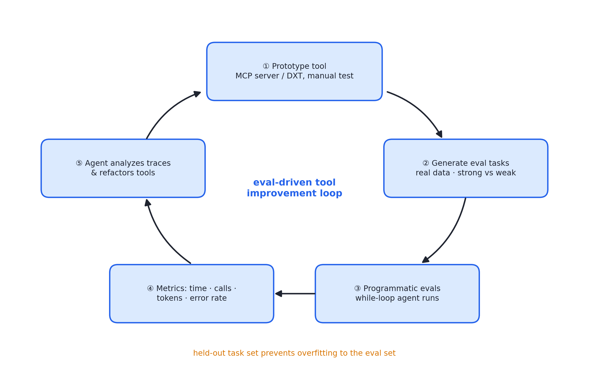

# 述评 04 | Writing Effective Tools for Agents — with Agents（Anthropic，2025-09）

> Aizawa, K. (2025). *Writing Effective Tools for Agents — with Agents*. Anthropic Engineering Blog. 全文见 [original.md](./original.md)（检索于 2026-09-12）。

## 摘要

本文讨论智能体工具层的工程化改进方法。文献提出，工具在本质上构成"确定性系统与非确定性调用方之间的契约"；在此基础上给出一套评测驱动的工具开发流程——原型构建、评测任务生成、程序化评测、智能体协作改进——并总结五条设计原则：审慎选择要实现的工具、以命名空间划定功能边界、返回高信号上下文、优化响应的 token 效率、对工具描述实施提示工程。文中报告的内部实践表明，评测驱动的迭代能够使工具性能超过"专家手写"的基线。

## 1 文献定位与背景

本文发布于 2025 年 9 月，作者 Ken Aizawa（Anthropic），写作背景是模型上下文协议（Model Context Protocol, MCP）生态扩张后单个智能体可用工具数量的急剧增长。其方法上的独特之处在于：文中建议并非作者先验总结，而是"用智能体写工具、用评测改工具"流程的产物——Anthropic 内部以 Claude Code 反复优化内部工具实现，并以 held-out 测试集防止对评测集过拟合。

在文献群中，本文属第二组（上下文、工具与技能），上承 [01 号述评](../01-anthropic-building-effective-agents/commentary.md)提出的 ACI 概念与 [03 号述评](../03-anthropic-context-engineering/commentary.md)的"工具即契约"论断，下与 05 号（知识层）互补；本书第 11 章"工具层治理"是本文的完整展开。

## 2 核心命题与贡献

### 2.1 工具的契约观：确定性系统与非确定性调用方

传统应用程序接口（Application Programming Interface, API）面向确定性调用方，同一输入必得同一行为；智能体作为调用方则是非确定性的——它可能调用工具、凭参数知识直接作答、反问澄清，也可能产生幻觉。因此，**为智能体编写工具不等同于为开发者编写 API**——这是全文的立论原点：工具描述须同时承担规格说明与使用教学的双重职能。作者的经验观察是：对智能体"符合人体工学"的工具，对人而言往往也意外直观。

### 2.2 评测驱动的工具开发流程

图 04.1 · 评测驱动的工具开发闭环：智能体分析轨迹并重构工具，形成"以智能体改进智能体环境"的元级循环

流程五个环节：

1. **原型构建**：经本地 MCP 服务器或 DXT 接入手测；
2. **评测任务生成**：基于真实数据源与服务，避免过度简化的沙盒环境——强任务如"为提交退订的客户准备挽留方案，查明原因、确定方案、识别风险"，对照弱任务如"按 ID 查记录"（后者测不出工具的可供性）；
3. **程序化评测**：以 while 循环智能体逐任务运行；验证器从精确字符串匹配到模型裁判均可，但须避免因格式、标点或同义改写拒绝正确答案；
4. **指标收集**：耗时、调用次数、token 消耗、错误率；
5. **智能体协作改进**：让智能体分析轨迹并批量重构工具。

### 2.3 工具设计五原则

- **原则一 · 选对工具**：常见错误是将既有 API 端点原样包装为工具。智能体的上下文昂贵而计算机内存廉价，故应实现 search_contacts 而非 list_contacts；工具应合并高频链式操作（如以 schedule_event 取代 list_users 加 list_events 加 create_event；以 get_customer_context 一次编译客户全部相关信息）。判据是：工具使智能体像人一样切分任务，同时省去中间输出对上下文的占用；
- **原则二 · 命名空间**：在数十个服务器、数百工具的规模下，以前缀分组（asana_search、asana_projects_search）划清功能边界；前缀式与后缀式命名的效应因模型而异，应以自身评测为准。收益有二：加载的描述更少，且把"选哪个工具"的计算从模型上下文卸回工具系统；
- **原则三 · 返回高信号**：优先上下文相关性而非灵活性——少返回 uuid、mime_type 类技术标识，多返回 name、file_type 类语义字段；仅将任意字母数字 ID 解析为语义名即可显著减少幻觉。需要两类标识符并存时，可提供 response_format 枚举（concise/detailed）。响应结构（XML、JSON（JavaScript Object Notation）、Markdown）对性能有影响且无普适最优，应按评测选择；
- **原则四 · token 效率**：对可能占用大量上下文的响应实施分页、范围选择、过滤与截断并配合理默认值（Claude Code 默认 25000 token 上限）；截断须配引导性指令（"多次小的定向搜索优于一次大而全的搜索"）；错误信息必须可执行——返回具体改进建议而非不透明的错误码或堆栈；
- **原则五 · 描述工程**：以向新入职同事介绍工具的标准撰写描述——将隐性上下文（专用查询格式、行话、资源关系）显式化；参数命名无歧义（user_id 而非 user）；以严格数据模型强制输入输出。经验证据：对工具描述的精确打磨使 Claude Sonnet 3.5 在 SWE-bench Verified 上取得当时的最优成绩；web search 工具曾被模型无端在 query 参数中追加"2025"的缺陷，经改写描述治愈。

## 3 机制与方法的评述

- **契约观的形式化**：将工具设计从接口问题重新界定为接口与调用方认知特性的匹配问题——非确定性调用方要求工具描述同时承担规格说明与使用教学的双重职能；
- **评测驱动流程的同构性**：把工具开发纳入与模型迭代同构的评测-回归循环；"让智能体分析轨迹并重构工具"构成以智能体改进智能体环境的元级循环——这一自指结构是本文最独特的贡献；
- **五原则共享同一经济逻辑**：智能体的稀缺资源是上下文与注意力，工具的职责是降低每次决策与每字节上下文的成本；选对工具、命名空间、高信号返回与 token 上限均可由该逻辑推导；
- **可观测性方案**：多指标联合观察（调用次数、耗时、token、错误率）为工具层提供了可观测性，与 08 号文献的轨迹树互补。

## 4 局限与批判性讨论

- **证据以内部实践与个案为主**（Slack 与 Asana 内部工具、web search 案例）："超过专家手写基线"的对照实验细节未披露，效应量难以独立评估；
- **评测任务的构造依赖高质量输入**：真实数据源与验证器设计决定评测效度；文中承认验证器过严或过松均损害效度，但未给出系统化的校准方法；
- **工具合并存在反面**：过度合并增加单工具复杂度与描述负担，本文以"针对高影响工作流"作限定，但未提供合并粒度的判据；
- **格式选择转移的边界未讨论**：response_format 等方案将格式选择转移至调用方模型——在弱模型环境下可能适得其反；
- **建议的有效期受生态演进约束**：协议演进（MCP 规范更新）可能改变命名空间与工具注解的最佳实践。

## 5 与相关文献及本书的关联

在文献群内部，01 号（ACI 概念源头）、03 号（契约观与 token 效率同源）、05 号（工具层与知识层的分工）、07 号（描述工程在提示侧的对应物）、08 号（评测方法学）与本文直接相关。在本书中，本文观点主要锚定于第 03、11、17、22 章：

| 本文概念 | 本书位置 | 实战册 |
|---|---|---|
| 契约观（确定性↔非确定性） | 第 03、11 章 | stage03 schema 校验-重试 |
| 选对工具/合并链式操作 | 第 11 章工具层治理 | stage02 工具注册 |
| 命名空间 | 第 17 章 MCP 工具生态 | stage10 MCP bridge |
| 高信号返回 + 语义 ID | 第 11 章 | stage03 结果截断（head/tail 保留） |
| 可执行的错误信息 | 第 11 章"错误返回即提示" | stage03 repair_message |
| 评测驱动改工具 | 第 22 章评测驱动开发 | stage11 模型裁判 |
