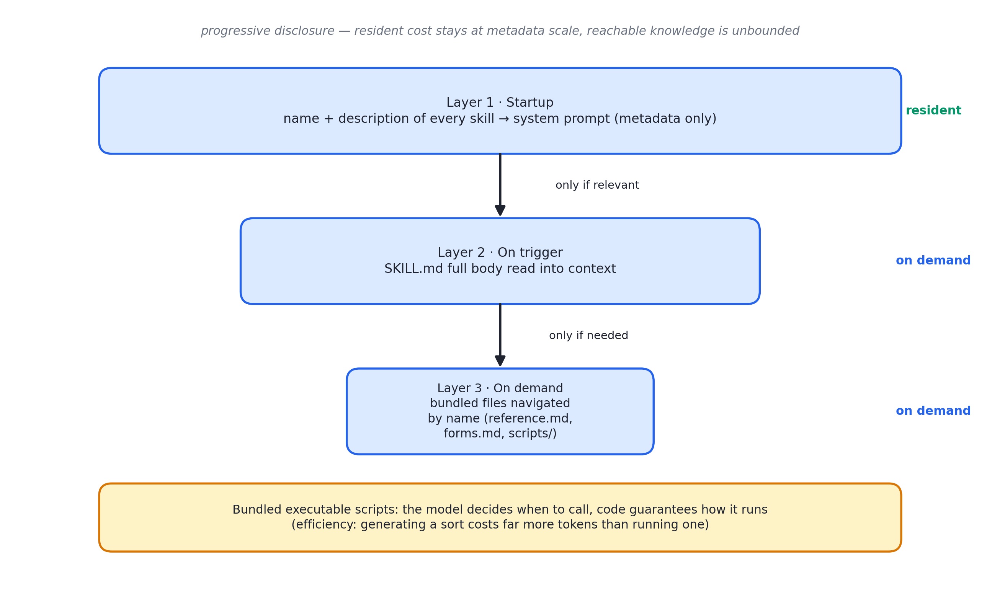

# 述评 05 | Equipping Agents for the Real World with Agent Skills（Anthropic，2025-10）

> Zhang, B., Lazuka, K., & Murag, M. (2025). *Equipping Agents for the Real World with Agent Skills*. Anthropic Engineering Blog. 全文见 [original.md](./original.md)（检索于 2026-09-12）。

## 摘要

本文提出并规范了 Agent Skills 机制：以"包含 SKILL.md 的目录"为最小载体，将领域过程性知识打包为智能体可动态发现与加载的能力单元。机制的核心是渐进式披露（progressive disclosure）的三层加载——元数据常驻系统提示、正文按需读取、捆绑资源进一步按需导航——辅以可执行脚本使确定性操作回归代码。文章同时给出技能开发与评测准则，并讨论恶意技能引入的安全风险。

## 1 文献定位与背景

本文发布于 2025 年 10 月，作者为 Barry Zhang、Keith Lazuka 与 Mahesh Murag，与 Claude 文档编辑能力上线同期，PDF 技能为官方示范案例。文首更新注载明：2025 年 12 月 18 日起 Agent Skills 发布为开放标准（agentskills.io），实现跨平台移植——这一演进路径与模型上下文协议（Model Context Protocol, MCP）的开放策略一致，印证了"厂商特性收敛为开放标准"的行业趋势。

在文献群中，本文属第二组（上下文、工具与技能）：它将 [03 号述评](../03-anthropic-context-engineering/commentary.md)的"按需加载"思想落实为知识层的具体机制，与 04 号的工具层分工互补，[14 号述评](../14-openai-harness-engineering/commentary.md)所评文献则将其引申为仓库级实现。本书第 14 章以本文为原始文献。

## 2 核心命题与贡献

### 2.1 动机与定位：能力包而非专用智能体

具备完整计算环境（文件系统与代码执行）的通用智能体，无需为每个场景构建碎片化的专用智能体；应当把过程性知识打包为可组合、可分享的能力包。核心类比贯穿全文："为智能体构建技能，如同为新员工撰写入职指南。"

### 2.2 三层渐进式披露

图 05.1 · 渐进式披露三层加载：常驻成本压缩至元数据量级，可及知识总量不受窗口约束

- **第一层**：启动时仅将全部技能的 name 与 description 预载入系统提示，足以让模型判断触发时机而不加载正文；
- **第二层**：判断相关后才将 SKILL.md 全文读入上下文；
- **第三层**：SKILL.md 按名引用目录内捆绑文件（如 reference.md、forms.md），模型仅在需要时导航读取。

由于智能体拥有文件系统，技能可捆绑的上下文总量实际上不受限制——结构类似"目录、章节、附录"的层级手册。

### 2.3 触发机制与代码执行维度

**触发无需新协议**：读取技能经由普通工具调用（如以 Bash 读文件）完成——技能机制本质上是把"按需读文档"组织为规范，而非引入新的运行时组件。这一设计的简单性是其可移植性的前提。

**代码执行维度**：技能可携带可执行脚本，由模型依任务性质自行决定调用。理由有二：

- **效率**：以 token 生成完成排序远贵于直接运行排序算法；
- **确定性可靠性**：许多应用要求只有代码能提供的一致与可复现。

PDF 技能的表单字段提取脚本在运行时，脚本与 PDF 本身均不进入上下文。

### 2.4 开发评测准则与安全边界

开发与评测五准则：

- 先以代表性任务评测找出能力缺口，再增量构建技能；
- SKILL.md 膨胀即拆分为独立文件并按名引用（互斥场景分路径存放以节省 token）；
- 代码兼具工具与文档双重身份，须写明应直接执行还是读入作参考；
- 从模型视角迭代——重点监控 name 与 description 的触发准确性；
- 与模型共写——令其将成功路径与常见错误沉淀入技能、失败后自省。

安全边界：技能即"指令加代码"，恶意技能可在使用环境中制造漏洞或诱导数据外泄与未授权动作。文章建议仅安装可信来源的技能；对低信任来源须先行审计：通读捆绑文件、重点检查代码依赖与外联指令。

## 3 机制与方法的评述

- **注意力预算的可操作化**：渐进式披露以"目录—章节—附录"的文档结构为类比，将 [03 号述评](../03-anthropic-context-engineering/commentary.md)的注意力预算思想转化为可操作的知识组织方案——常驻成本被压缩至元数据量级，而可及知识总量不受窗口约束；
- **零协议膨胀的触发设计**：技能触发复用既有工具调用通道，机制的简单性使其得以在数周内跨产品落地并开放为标准；
- **同构的自举循环**："让智能体沉淀自身经验入技能"的开发循环与 04 号"让智能体改进工具"形成同构——两者均以智能体为改进智能体环境的主体，提示环境资产的维护正在成为智能体的自举任务；
- **确定性的重新引入**：代码执行维度把确定性重新引入非确定性系统——模型决定何时调用，代码保证如何执行，分工边界清晰。

## 4 局限与批判性讨论

- **触发准确性缺乏度量方案**：误触发与漏触发均依赖 name 与 description 的撰写质量；文中建议"监控实际使用并迭代"，属人工观察而非可复现的评测协议；
- **安全模型较为薄弱**：审计建议依赖人工通读捆绑文件，对隐蔽形态的提示注入（如图片元数据、长尾引用文件中的指令）未给出防御机制；技能分发的供应链治理（签名、来源信誉体系）在本文发表时仍属缺位；
- **三层加载的成本模型偏乐观**：元数据常驻在技能数量巨大时仍线性增长，数百技能场景下的常驻预算未被讨论；
- **技能间的依赖与冲突未讨论**：两个技能对同一任务给出矛盾流程的情形未被处理；
- **与检索增强生成（Retrieval-Augmented Generation, RAG）的分工未正面论证**：事实召回归检索、流程知识归技能的边界在社区讨论中已经明确，但本文未予阐述。

## 5 与相关文献及本书的关联

在文献群内部，03 号（按需加载思想）、04 号（工具层分工）、14 号（仓库级渐进披露）与本文直接相关；06 号的 CLAUDE.md 常驻知识构成"常驻与按需"的对照面。在本书中，本文观点主要锚定于第 11、14、23 章：

| 本文概念 | 本书位置 | 实战册 |
|---|---|---|
| 三层渐进披露 | 第 14 章主体 | stage10 skills.py（~50 token 元数据常驻） |
| name/description 触发器 | 第 14.3 节 | stage10 SKILL.md frontmatter 解析 |
| 捆绑资源按需读 | 第 14.2 节第三层 | stage10 read_skill_ref |
| 代码 = 确定性工具 | 第 11 章源头截断 | stage07 run_python 黑名单 |
| 技能投毒风险 | 第 23 章注入面 | stage07 数据通道清洗 |
| MCP 连接 × Skill 流程 × RAG 事实 | 第 14.4 节 | stage10 + stage11 组合 |
