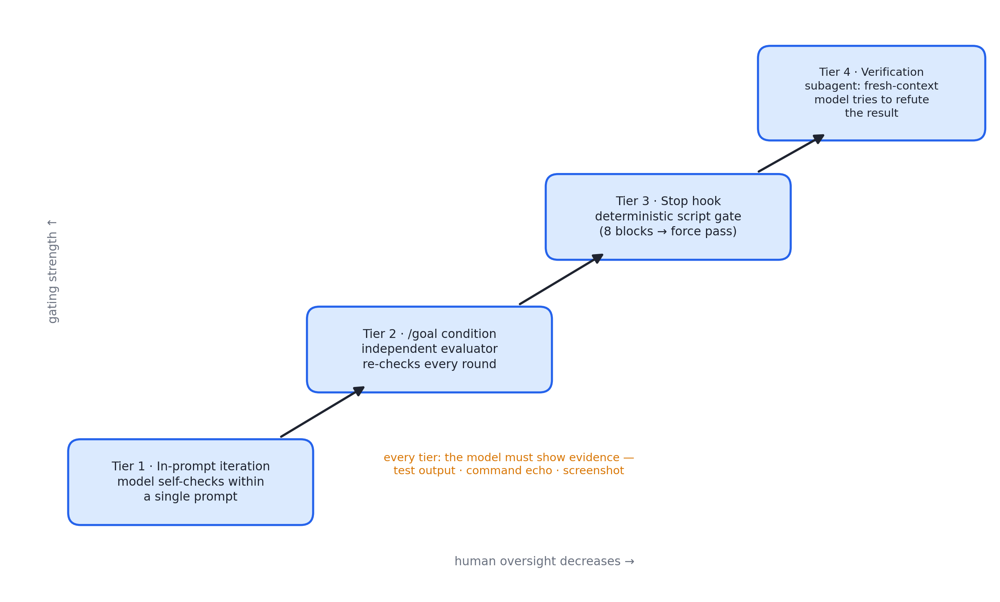
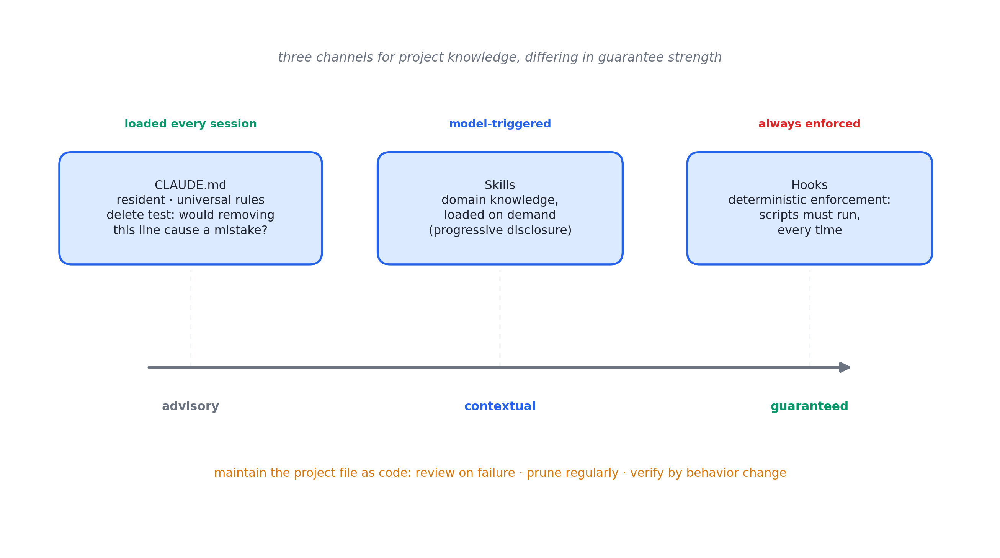

# 述评 06 | Claude Code: Best Practices for Agentic Coding（Anthropic，2025-04）

> Anthropic (2025). *Claude Code: Best Practices for Agentic Coding*. Claude Code 官方文档（code.claude.com/docs/en/best-practices；初版为 2025-04-18 发布的工程博客，后扩展为现行文档页）。全文见 [original.md](./original.md)（检索于 2026-09-12）。

## 摘要

本文是 Anthropic 智能体编码产品 Claude Code 的官方实践指南，初版于 2025 年 4 月以工程博客形式发布，后扩展为现行文档页。文献以单一约束为纲——上下文窗口随会话填充而性能退化——推演出覆盖验证闭环、任务规划、提示设计、环境配置、会话管理与并行扩展六个层面的操作纪律。其价值超出产品手册范畴：验证门控的四档强度、宪法式项目文件的编辑纪律、确定性钩子与建议性指令的区分等机制设计，对任何智能体产品的交互设计均有参照意义。

## 1 文献定位与背景

本文的体裁演变（工程博客到官方文档）本身即具文献价值：说明其内容经过大规模用户实践的沉淀与修正。与 [01 号述评](../01-anthropic-building-effective-agents/commentary.md)所评的范式文献不同，本文是一线操作的积累，每项建议均可在产品中立刻执行；但其机制类别（确定性门控、独立评估器、上下文隔离）具有跨产品的可移植性。

在文献群中，本文属第二组（上下文、工具与技能）：它是 [03 号述评](../03-anthropic-context-engineering/commentary.md)所评上下文工程理论的产品级注脚，也是 [05 号述评](../05-anthropic-agent-skills/commentary.md)所评技能机制与 04 号工具准则的消费端实例。全文的演绎起点被明确陈述为"一个约束"：上下文窗口装下整个会话（每条消息、每次读文件、每条命令输出），而模型性能随填充退化——所有最佳实践皆是该约束的推论。

## 2 核心命题与贡献

### 2.1 唯一核心约束与验证门控四档

图 06.1 · 验证门控的四档强度：人工监督逐级让位于机制化验证

**可运行验证是自主性的前提**：没有可运行的检查时，"看起来做完了"是唯一信号，用户本人即成为验证回路。检查形态包括测试套件、构建退出码、静态检查、基准输出对比与截图对比。门控强度分四档递增：

- **单次提示内迭代**：模型在同一提示内自检；
- **/goal 条件**：独立评估器每轮复查，未达成则继续；
- **Stop hook 确定性门**：脚本判定，连续八次阻止后强制放行；
- **验证 subagent**：以全新上下文的模型尝试反驳结论，实现"干活的不打分"。

文章同时要求模型出示证据（测试输出、命令回显、截图）而非口头宣称成功。

### 2.2 探索-计划-实现-提交与提示具体性

以只读的**计划模式**将研究与执行分离，避免解错题；工作流为探索、计划、实现、提交四段。同时给出克制条件：一句话能描述的改动直接执行，计划仅用于方法不确定、跨多文件或不熟悉代码的情形。

提示的具体性策略：限定文件、场景与测试偏好；指向信息源（如代码库历史）；引用既有模式（"遵循 HotDogWidget.php 的写法"）；描述症状、疑似位置与"修好"的判据。文章同时保留模糊提示在探索期的价值。

### 2.3 CLAUDE.md 编辑纪律与知识分层

图 06.2 · CLAUDE.md、Skills、Hooks 三条知识通道，按保证强度排列

CLAUDE.md 每次会话加载，故只放普适内容，领域知识移入 skills 按需加载；核心判据为"删掉这一行会导致犯错吗"；臃肿的文件会使真正的指令被淹没，个别顽固规则可单独强调。文件应作为代码维护——出错时审查、定期修剪、以行为变化验证修改。

### 2.4 权限沙盒、钩子分工与 subagent 双用法

**权限与沙盒**：预批准可信工具加操作系统级沙盒内放手；自动模式以分类器模型代替人工审查多数动作，拦截范围升级、未知基础设施与敌意内容驱动的操作——这是"分类器把关加乐观执行"的产品化实例。

**钩子与技能的分工**：钩子是确定性保证（必须每次发生的动作由脚本强制）；项目文件中的指令仅具建议性；技能承载可复用领域知识与工作流，可配置为仅限人工触发。

**subagent 的两种用法**：

- 调研隔离：将读文件的开销隔离在子上下文，保持主会话干净；
- 对抗审查：全新上下文的审查者只看改动与标准、不知产生它的推理，故评估更客观。

文章并警告其对称缺陷——被要求找茬的审查者总能找到茬，须限定"只报影响正确性或需求的缺口"，否则诱发过度工程。

### 2.5 会话管理、并行扩展与五个失败模式

- **会话管理**：同一问题纠偏两次仍错即重开会话——干净上下文加更好的初始提示，几乎总是优于在污染上下文中继续修补；定向压缩（可指定压缩时必须保留的内容）；检查点可回滚对话与代码（仅覆盖经编辑工具的改动，不替代版本控制）；会话命名与恢复；
- **并行与扩展**：无头模式接入持续集成与提交前钩子；以工作树隔离多会话；写者/审查者双会话模式（评审者对刚写出的代码没有自我偏袒）；批量扇出遵循"生成任务清单、脚本循环、先以两三个文件调试提示再全量"的顺序——评测驱动的渐进验证被移植到提示层；
- **五个失败模式**：大杂烩会话、反复纠错、过度膨胀的项目文件、信任与验证脱节、无边界探索——各配一条一句话修复。

## 3 机制与方法的评述

- **"唯一核心约束"的演绎结构**：赋予文档罕见的一致性——验证闭环（压缩人工监督成本）、计划模式（避免在污染上下文中试错）、subagent 隔离（保护主上下文）、会话重置纪律（重置退化资源）均可视为同一资源模型下的对策，与 03 号的注意力预算构成理论与应用的关系；
- **四档门控的机制分类价值**：其阶梯结构（提示内迭代、条件评估、确定性钩子、独立反驳）刻画了人工监督与自主性之间的连续调节空间，为产品交互设计提供了可移植的分类；
- **对对称缺陷的自我批判**：对抗审查一节对"找茬者总能找到茬"的警告，在评测方法学上与模型裁判文献关于评审偏差的讨论一致，属实践文档中少见的自我批判；
- **评测驱动思想的跨层移植**：扇出操作"先小样本调试提示再全量"的纪律，将评测驱动思想从模型层移植到提示层。

## 4 局限与批判性讨论

- **产品绑定**：/goal、Stop hook、检查点等功能为该产品专有，机制类别可移植而操作细节不可，跨产品读者需自行完成抽象；
- **官方文档的引导职能**：失败仅作模式化列举，无失败率、成本或对照数据；
- **核心约束作为公理陈述**："上下文填满即退化"未引用量化证据——[03 号述评](../03-anthropic-context-engineering/commentary.md)所评文献与第三方 context rot 研究提供实证支撑，但文档未回指；
- **自动模式引入新失效面**：分类器审查的误判风险文中以回退机制简要处理，风险评估不充分；
- **治理依赖持续自律**：项目文件纪律依赖维护者的持续自律，"当作代码维护"的建议在团队场景中缺乏强制机制，该治理问题未展开。

## 5 与相关文献及本书的关联

在文献群内部，03 号（上下文资源模型）、05 号（技能机制的消费端）、07 号（路线对照：本文代表"重心移向环境配置"，OpenAI 则"以训练适配提示区块"）、08 号（对抗审查与评测方法学）、14 号（环境与 harness 设计的运维侧延伸）与本文直接相关。在本书中，本文观点主要锚定于第 08、10、11、15、16、22 章：

| 本文概念 | 本书位置 | 实战册 |
|---|---|---|
| 上下文即第一资源 | 第 10 章开篇 | stage03 |
| 可运行验证 + 四档门控 | 第 08、22 章 | stage06 确认门、stage11 评测 |
| 对抗审查（fresh context） | 第 22 章裁判 | stage11 异族裁判 |
| CLAUDE.md ≈ 宪法文件 | 第 11 章宪法式系统提示 | stage03 |
| subagent 调研隔离 | 第 15 章 | stage05 |
| /compact 定向压缩 | 第 12 章 | stage03 compact |
| 无头模式 + 批量 fan-out | 第 16 章编排 | stage05 run_parallel |
