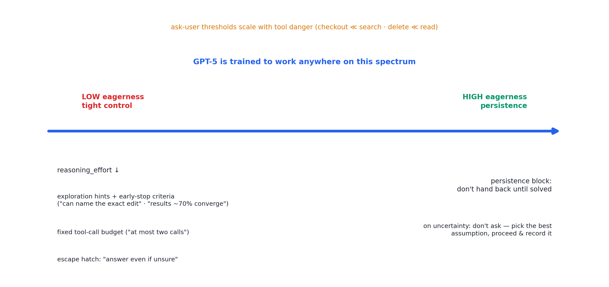
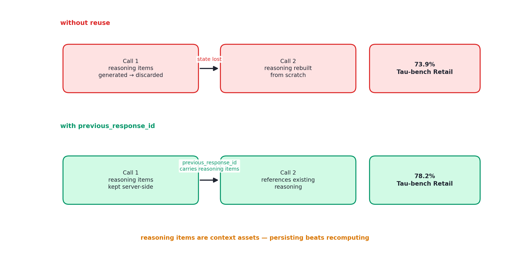

# 述评 07 | GPT-5 Prompting Guide（OpenAI，2025-08）

> OpenAI (2025). *GPT-5 Prompting Guide*. OpenAI Cookbook（该页现已标注归档，可能引用过时的模型或接口；本档案由 openai-cookbook 开源仓库的 notebook 源文件转写）。全文见 [original.md](./original.md)（检索于 2026-09-12）。

## 摘要

本文是 OpenAI 随 GPT-5 发布的官方提示指南，代表模型训练方对"推理能力内化时代，提示工程如何演变"的正式陈述。文献的核心主张是：智能体行为的主动性（agentic eagerness）已成为可在提示与参数两个层面调节的维度；工具调用前的过程播报（tool preambles）与推理上下文的跨调用复用构成智能体可预测性与经济性的两项新杠杆。指南同时覆盖编码任务的提示优化（含代码编辑器 Cursor 的生产调优复盘）、指令冲突消解与元提示，附录提供三份可直接套用的完整提示模板。

## 1 文献定位与背景

本文发布于 2025 年 8 月 7 日；检索时官方页面已标注归档，本档案经开源仓库的 notebook 源文件转写，代码单元以围栏形式保留。其体裁为训练方亲述的"提示层契约"：模型在训练阶段即针对特定提示结构（persistence、tool_preambles、context_gathering 等区块）作了优化——提示与模型共同设计，是本文区别于 [01 号述评](../01-anthropic-building-effective-agents/commentary.md)至 06 号"系统设计"视角的根本特征。

在文献群中，本文属第二组（上下文、工具与技能），并与 [06 号述评](../06-anthropic-claude-code-best-practices/commentary.md)构成两家路线分歧的实证：Anthropic 将工程重心移向环境与 harness，OpenAI 仍将提示视为第一杠杆，以训练适配特定提示区块。

## 2 核心命题与贡献

### 2.1 主动性调节光谱与危险度分级

图 07.1 · 主动性（eagerness）调节光谱：调低与调高两侧各有提示层与参数层杠杆

智能体脚手架从"决策全权委托模型"延伸到"程序分支紧控"，GPT-5 被训练为可在光谱任意位置工作。**调低主动性**的杠杆：

- 降低 reasoning_effort 参数；
- 在提示中给出探索方法与早停判据（"能说出要修改的确切内容""检索结果约七成收敛于同一路径"）；
- 设置固定工具调用预算（"至多两次调用"）；
- 以逃生舱条款（"即使可能不完全正确也先行作答"）降低模型满足短流程的阻力。

**调高主动性**：persistence 区块——问题完全解决前不交还控制权；遇不确定性不回头询问，选定最合理假设继续推进并记录在案。

"何时应回头询问用户"还应按**工具危险度差异化**设定：购物场景中结账与支付工具的询问阈值应远低于搜索工具；编码场景中删除文件工具应远低于检索工具。这是安全阈值与动作可逆性挂钩的提示层表述。

### 2.2 工具前奏与推理上下文复用

图 07.2 · previous_response_id 跨调用保留推理项：持久化替代重算，Tau-bench Retail 得分 73.9% → 78.2%

**工具前奏（tool preambles）**：模型受训练在调用工具前复述目标、列出结构化计划、逐步播报进度、结束时对照计划总结——长任务的可观测性被内建于模型行为本身，前奏的频率与详略可在提示中调节。

**推理上下文复用**：Responses API（Application Programming Interface, API）经 previous_response_id 跨工具调用保留推理项，使模型得以引用既有推理轨迹而免于每次调用后重建计划；报告的量化效应为 Tau-bench Retail 得分由 73.9% 升至 78.2%。"推理项也是上下文资产"是本文对上下文工程的增量命题——不仅管理进入窗口的信息，还管理推理状态的持久化。

### 2.3 编码任务优化与 Cursor 生产复盘

- **规划先于执行**：复杂迁移尤应先行产出实现计划；零到一应用生成采用自我反思提示——先构建五至七类评分细则，再依细则内部迭代；增量改动应融入既有代码库的设计标准；
- **Cursor 复盘的调优组合**：全局将 verbosity 参数设为低、再以提示对编码工具单独调高——兼顾状态更新简短与代码可读；
- **负结果证据（本文最稀缺的价值）**：对旧模型有效的"最大化上下文理解"指令对 GPT-5 反而诱发工具滥用，删改后行为恢复合理；结构化 XML 区块在其测试中提升了指令遵循度。

### 2.4 指令冲突消解、元提示与提示模板

GPT-5 的精确指令遵循使含矛盾指令的提示比其他模型受损更重——模型消耗推理 token 寻求调和而非随机取舍。医疗调度示例展示了两类矛盾的识别与修复（紧急情形与档案查询的冲突、自动指派与患者同意的冲突）。

其余主题：minimal reasoning 档位的补偿性提示（先给简短解释、详尽的过程播报、消歧工具指令、提示式规划）；Markdown 格式的诱导与长对话中的周期性重申；元提示——以模型自身改进提示。

附录即工具箱：SWE-bench Verified 开发者指令、Tau-bench 零售域完整流程规范、Terminal-Bench 提示三份模板，示范了"提示资产"的应然形态——结构化、可审计、按域定制，其中零售域规范相当于一份给模型的标准作业程序（Standard Operating Procedure, SOP）。

## 3 机制与方法的评述

- **控制问题的新自由度**："主动性可调"将智能体控制问题从脚手架侧（硬上限、确认门）扩展到提示与参数侧，二者互补而非替代——危险度分级阈值与确认门的对应关系即是明证；
- **可观测性的二分**：工具前奏把可观测性一分为二——harness 侧的轨迹记录与模型侧的行为播报；本文证明后者可经训练获得，为观测设计提供了新的自由度；
- **少见的单干预净效应**：推理上下文复用的量化证据（73.9% 对 78.2%）在全部文献中少见地给出了单一干预的净效应，其经济学含义——推理 token 的持久化替代重算——与本书第 12 章的缓存经济学同构；
- **提示资产的代际失效**：Cursor 复盘的核心价值在于负结果——对旧模型有效的指令对新模型适得其反，说明提示资产存在跨模型代际的失效问题，为"提示即配置"的论断提供了实证注脚。

## 4 局限与批判性讨论

- **时效性**：文档针对 GPT-5 一代，具体参数与行为承诺随归档而衰减；引用时应区分可迁移的机制（早停判据、阈值分级）与模型专属手段（reasoning_effort、Responses API）；
- **供应商中立性缺位**：Responses API 的推荐未与替代实现比较，性能增益的归因无法剥离平台因素；
- **评测报告的稳健性存疑**：未披露方差与多次运行细节，单点数字的可靠性有限；
- **与人在环的张力**：persistence 类指令的激进形态（"绝不回头询问"）与高风险场景中的人在环原则存在张力——文中以按工具危险度差异化阈值部分缓解，但 persistence 与确认门组合时的失效模式未被讨论；
- **自我反思的循环论证风险**：评分细则的有效性依赖模型审美判断的可靠性——以模型自评保证模型输出质量存在循环论证风险，其上限未被讨论。

## 5 与相关文献及本书的关联

在文献群内部，02、10、11 号（OpenAI 系内概念的一贯性）、03 号（推理项作为上下文资产的延伸）、06 号（两家路线分歧的对照）、08 与 13 号（可观测性与判分的 harness 侧对应物）与本文直接相关。在本书中，本文观点主要锚定于第 11、12、19、21、23 章：

| 本文概念 | 本书位置 | 实战册 |
|---|---|---|
| eagerness 光谱 + 早停判据 | 第 19 章思考预算、第 21 章 | stage06 max_turns/stall 检测 |
| 危险度分级的"回头问人"阈值 | 第 23 章权限 | stage06 危险确认门、stage07 三态权限 |
| tool preambles | 第 20 章过程可见性 | stage08 Span 轨迹的模型侧版本 |
| 推理上下文复用 | 第 12 章 KV 缓存经济学 | stage03 append-only 历史 |
| 域 SOP 提示模板 | 第 11 章宪法式系统提示 | stage03 宪法区 |
