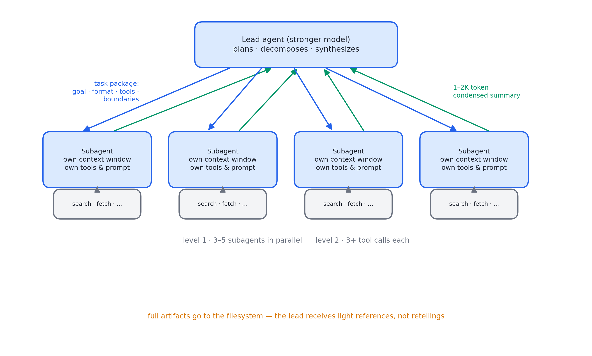
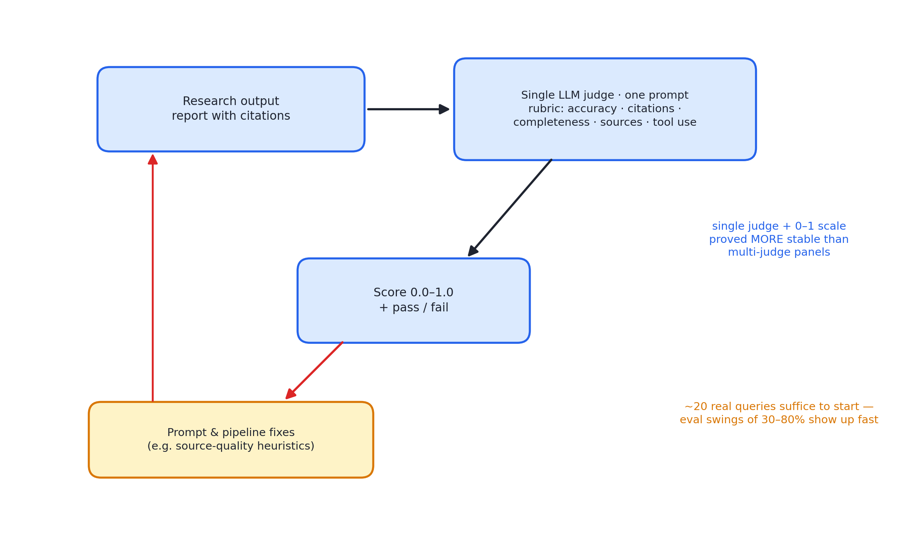

# 述评 08 | How We Built Our Multi-Agent Research System（Anthropic，2025-06）

> Hadfield, J., Zhang, B., Lien, K., Scholz, F., Fox, J., & Ford, D. (2025). *How We Built Our Multi-Agent Research System*. Anthropic Engineering Blog. 全文见 [original.md](./original.md)（检索于 2026-09-12）。

## 摘要

本文是 Anthropic Research 功能——多智能体深度调研系统——从原型到生产的工程复盘，属多智能体编排领域少有的公开生产级报告。系统采用编排者-工人（orchestrator-worker）架构：主智能体规划研究过程并派生并行 subagent 分头检索，随后归并结果。文章量化了该架构的收益（内部研究评测超越单智能体 90.2%）与代价（约 15 倍于对话场景的 token 消耗），给出八条提示工程原则、多智能体评测方法论与生产可靠性经验（状态管理、调试、部署协调），并坦承同步执行的架构局限。

## 1 文献定位与背景

本文发布于 2025 年 6 月，作者为 Jeremy Hadfield、Barry Zhang 等，写作背景是 Research 功能上线：主智能体依据用户查询规划研究过程，按需派生并行 subagent 分头搜索再行归并。它是"多智能体编排"从演示走向大规模产品的罕见公开复盘。

在文献群中，本文是第三组（编排与多智能体）的核心文献：它将 [01 号述评](../01-anthropic-building-effective-agents/commentary.md)的 orchestrator-workers 模式推进为产品级系统，为 [05 号述评](../05-anthropic-agent-skills/commentary.md)之外的委派原则提供实证基础，其评测方法论与 [13 号述评](../13-anthropic-harness-design-long-running-apps/commentary.md)所评文献的判分实践相衔接。

## 2 核心命题与贡献

### 2.1 研究任务为何适合多智能体

图 08.1 · 编排者-工人研究系统：两级并行与压缩式归并，产物直写文件系统

开放式问题无法预知所需步骤、过程路径依赖且需随发现转向，线性流水线无法胜任。全文的理论内核是一句概括："搜索的本质是压缩"——subagent 各自携带独立上下文窗口并行深潜，将最重要的 token 蒸馏回主智能体，同时以各自的工具、提示与探索轨迹实现关注点分离，降低路径依赖。

### 2.2 收益与代价的对称量化

- 内部研究评测中，以 Claude Opus 4 为主智能体、Sonnet 4 为 subagent 的多智能体系统超越单智能体 Opus 4 达 **90.2%**；
- 在 BrowseComp 基准上，三个因素解释了 95% 的性能方差，其中 **token 用量独占 80%**，其余为工具调用次数与模型选择——多智能体的本质是"把 token 消耗规模化的架构"；
- 模型升级是效率乘子：升级至 Sonnet 4 的收益大于将 Sonnet 3.7 的 token 预算翻倍；
- 代价同样被量化：智能体场景约消耗 4 倍于普通对话的 token，多智能体系统约 **15 倍**。

适用域判据由此得出——任务价值足以支付 token 成本、可重度并行、信息量超出单一上下文窗口、需与大量复杂工具交互。不适用情形：要求所有智能体共享同一上下文的任务（多数编码任务的并行度低于研究）、需要实时协作调度的场景。

### 2.3 八条提示工程原则

1. **像智能体一样思考**：以完全相同的提示与工具做逐步仿真，即可直接暴露失败模式（已有足够结果仍继续、查询冗长、选错工具）；
2. **教编排者委派**：子任务描述须含目标、输出格式、工具与信源指引、任务边界——"研究半导体短缺"式的模糊指令曾导致三个 subagent 重复搜索、无有效分工；
3. **努力度与查询复杂度匹配**：事实核查一智能体三至十次调用；对比类二至四个各十至十五次；复杂研究十个以上并明确分工；
4. **工具设计即人机接口**：先检视全部工具、按用户意图匹配、专用工具优先于通用工具；劣质描述可将智能体导入完全错误的路径；
5. **让智能体改进自身**：工具测试智能体反复使用有缺陷的 MCP（Model Context Protocol）工具后重写其描述，使后续智能体的任务完成时间下降 40%；
6. **先宽后窄**：以短泛查询摸清版图再逐步收窄；
7. **引导思考过程**：主智能体以扩展思考规划，subagent 在工具结果后以插值思考评估质量、识别缺口、修正查询；
8. **两级并行**：主智能体并行派生三至五个 subagent、子智能体并行三个以上工具调用——将复杂查询的研究时间最多削减 90%。

提示哲学收束为一句话：灌输启发式而非刚性规则——将人类专家的研究策略（任务分解、信源质量评估、随新信息调整、区分深度与广度）编码进提示，并以显式护栏防止失控。

### 2.4 多智能体评测方法论

图 08.2 · 单裁判评分闭环：量规打分、未达标反馈回提示与流水线修正

传统"输入 X 应循路径 Y 产出 Z"的评测在此失效——同一起点存在多条合理路径，只能判结果加合理过程。三个实践要点：

- **立即开始小规模评测**：约二十个真实查询即可观察到 30% 至 80% 量级的变化，不应以"评测集要足够大"为由推迟；
- **以模型裁判（LLM-as-judge）按量规打分**（事实准确、引用准确、完整性、信源质量、工具效率）：实验发现单次调用、单一提示、输出 0.0-1.0 分加通过/失败级的方案最稳定且最贴合人类判断；
- **人工测试补自动化之盲**：早期智能体系统性偏好搜索引擎优化的内容农场而忽视学术文献等权威信源，经加入信源质量启发式修复。

### 2.5 生产可靠性与同步架构局限

- **有状态与错误复利**：不能从头重跑，须支持断点恢复；将模型适应力（告知工具失败，令其自行调整）与确定性保障（重试逻辑、定期检查点）结合；
- **调试依赖全量生产追踪**：仅监测决策模式与交互结构、不查看对话内容以保护隐私；
- **rainbow 部署**：新旧版本并存、流量渐移——智能体近乎常驻运行，不能全量切换版本；
- **附录三则**：改变状态的任务宜做终态评测（按检查点拆分验证而非逐步验证）；长对话以"总结已完成阶段、外部记忆、派生新鲜 subagent"延续；subagent 产物直写文件系统、仅向协调者回传轻量引用——从架构上消除多级转述的信息损耗与 token 开销。

坦诚的架构局限：同步执行使主智能体必须等待全部 subagent 完成——无法中途纠偏、子智能体间无法协作、单个 subagent 可阻塞全系统。异步化可解锁额外并行，但引入结果协调、状态一致与错误传播的新难题。

## 3 机制与方法的评述

- **收益与代价的对称量化**使本文成为编排决策最可靠的实证参照：90.2% 的收益、15 倍的成本与 80% 的方差解释，共同构成"何时值得采用多智能体"的判据基础——这是 01 号定性论述所不具备的证据形态；
- **"教编排者委派"将失败归因于任务描述的信息量不足**：重复搜索的反例说明委派质量是编排系统的第一瓶颈，任务描述的结构化（目标、格式、工具、边界）由此获得经验支持；
- **评测方法论有两处超出常规实践**：一是明确论证了路径不确定条件下结果导向评测的必要性；二是单裁判方案的稳定性与"多裁判更客观"的直觉相反，为裁判设计提供了反直觉的校准；
- **可靠性部分是经典分布式系统实践与模型适应力的混合范式**：检查点、滚动部署与"让模型知道工具在失败"的优雅降级相结合。

## 4 局限与批判性讨论

- **评测的内部性**：90.2% 与方差分解均出自内部评测，BrowseComp 为单一基准，评测集构成未公开，第三方难以复现；"token 用量解释 80% 方差"属相关性证据，将其引申为"多智能体的本质是规模化 token"有过度归因之嫌——token 用量本身与任务投入度相关；
- **适用域判断以研究域为中心**：对编码域的否定（并行度不足、实时协作不佳）基于 2025 年中的模型能力，时效性强；
- **同步执行瓶颈被承认但未解决**：异步方案的协调复杂度被列举而未量化；
- **15 倍成本未区分任务价值层级**："任务价值足够高"的经济性判据缺少可操作的估值方法；
- **单裁判稳定性结论的适用域**：产生于自由文本研究报告域，对结构化输出的适用性未经检验。

## 5 与相关文献及本书的关联

在文献群内部，01 号（orchestrator-workers 模式的源头）、03 号（压缩与上下文隔离的理论）、05 号（技能与委派）、09 号（并行编排的极限压测）、12 与 13 号（harness 侧可靠性的延伸）与本文直接相关。在本书中，本文观点主要锚定于第 13、15、16、20、22、24、25 章：

| 本文概念 | 本书位置 | 实战册 |
|---|---|---|
| orchestrator-worker + 并行 spawn | 第 16 章全章 | stage05 ThreadPoolExecutor |
| 任务包四要素/五要素 | 第 15、16 章 | stage05 任务包 schema 强制 |
| 努力度分级规则 | 第 20 章 | stage06 预算控制 |
| 单裁判 0-1 分 + 通过/失败 | 第 22 章 | stage11 LLM-as-judge |
| 终态评测 | 第 22 章 | stage11 cases YAML |
| checkpoint 恢复 + rainbow 部署 | 第 24、25 章 | stage09 检查点 |
| 产物直写文件系统 | 第 13 章 | stage09 jobs/<id>.md |
