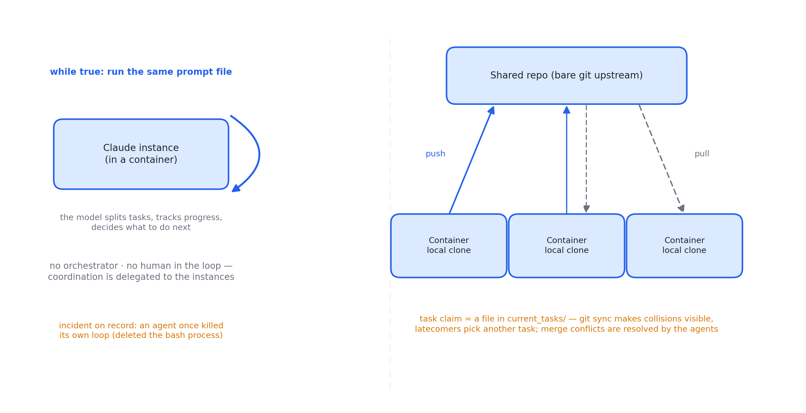
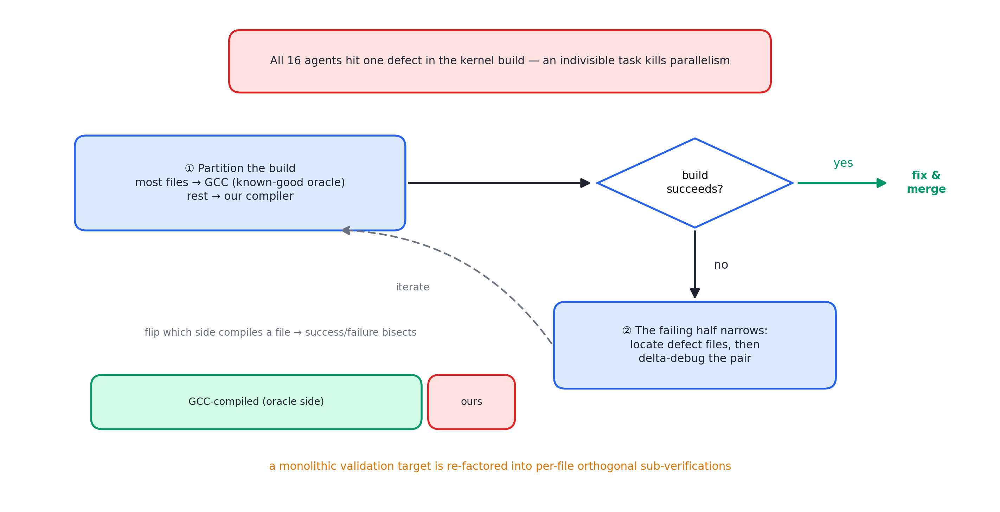

# 述评 09 | Building a C Compiler with a Team of Parallel Claudes（Anthropic，2026-02）

> Carlini, N. (2026). *Building a C Compiler with a Team of Parallel Claudes*. Anthropic Engineering Blog. 全文见 [original.md](./original.md)（检索于 2026-09-12；原文正文含演示视频，静态存档中以说明行代替）。

## 摘要

本文报告了一项智能体团队（agent teams）的极限压测实验：十六个 Claude 实例在无人类干预条件下并行工作于共享代码库，历经近两千个会话、约两万美元成本与两周时间，产出十万行规模的 C 编译器，可构建可启动的 Linux 6.9（覆盖 x86、ARM、RISC-V 三架构）。与系统本身相比，作者的论述重心在长时自治智能体团队的 harness 设计：以近乎完美的任务验证器替代人类监督、以文件锁与 git 同步实现粗粒度并行协作、以已知良好的参照编译器将不可分大任务重构为可并行子任务，并如实记录该方法的能力边界与安全隐忧。

## 1 文献定位与背景

作者 Nicholas Carlini（Anthropic Safeguards 团队研究员），发布于 2026 年 2 月。实验设计构成一次反向对照：与 [08 号述评](../08-anthropic-multi-agent-research-system/commentary.md)所评的产品级编排系统（同步编排、人类监督）相对，本实验没有编排智能体、没有人在环，全部基础设施仅是一个 bash 死循环、git 同步与高质量测试。作者明言动机为能力压测——测定当前模型"勉强能够达成"的边界；同一任务被用作 Claude 4 系列的跨代基准（Opus 4.5 首次跨过可用阈值，Opus 4.6 达成目标）。在文献群中，本文属第三组（编排与多智能体），是 [12 号述评](../12-anthropic-effective-harnesses/commentary.md)以降 harness 叙事的极限案例。

## 2 核心命题与贡献

### 2.1 极简 harness 与裸 git 并行

图 09.1 · 极简 harness：bash 死循环驱动容器内实例，文件锁与 git 同步承担全部协调

**极简 harness**：while 循环中以命令行方式反复执行同一提示文件（在容器内运行），提示要求模型自行拆解任务、跟踪进度、决定下一步并持续工作。作者记录了智能体误杀自身循环的事故（误删 bash 进程）作为自治系统运维现实的注脚。

**并行的动机与同步算法**：并行解决单会话的两个弱点——一次只能处理一件事；无法角色专精。实现为"裸 git"：每个智能体一个容器，克隆至本地工作区，完成后推送上游。防并发冲突机制是文件锁——认领任务即向 current_tasks/ 写入文件，git 同步天然迫使后来者改选任务；合并冲突频发但由模型自行解决。作者强调系统没有高层目标管理、没有编排者：行为协调完全交由每个实例自行判断，卡住时常自行维护失败尝试与剩余任务的运行文档。

### 2.2 经验一：高质量验证器即任务定义

无人在环时任务验证器几乎决定成败——验证器不完美，智能体就会解错题。作者的工作重心全在环境侧：引入高质量编译器测试套件、为开源软件编写验证与构建脚本、观察智能体犯错模式后补充测试；项目后期为遏制"新功能破坏旧功能"，引入持续集成的强约束。

### 2.3 经验二：模型视角的环境设计

此为 04 号文献"agent 视角"的 harness 版，两项代表性别称：

- **上下文污染控制**：测试输出至多数行摘要，细节落日志文件，错误行以 ERROR 标记便于 grep 定位，聚合统计预计算以免智能体重算；
- **时间盲补偿**：模型无时间感，会将大量时间耗于空跑测试——harness 提供确定性抽样的 --fast 模式（1% 或 10% 样本，同一智能体确定、跨机随机，兼顾全量覆盖与回归定位）。

### 2.4 经验三：参照编译器二分与问题重构

图 09.2 · 以 GCC 为 oracle 的二分定位：把不可分的内核构建重构为按文件的子验证

测试失败多时分工天然（各领一个失败用例）；通过率达 99% 后转为"让 SQLite、Redis、Lua 等项目编译通过"的独立目标。编译 Linux 内核时十六个智能体全部撞上同一缺陷并互相覆盖——**大任务不可分导致并行失效**。解法是以 GCC 为已知良好的参照编译器做二分：随机将大部分内核文件交 GCC 编译、仅以自研编译器处理其余文件，以成败定位缺陷文件，再以 delta debugging 定位共同失败对。这一重构将不可分大任务重新转化为可并行的碎任务，是全文方法论上最具启发价值的一步。

### 2.5 多角色专精、能力边界与安全反思

**多角色专精**：除主力修复外，专设去重智能体（大语言模型（Large Language Model, LLM）生成的代码常重造轮子）、编译器性能智能体、生成代码优化智能体、Rust 视角架构评审智能体与文档智能体。

**极限与边界的诚实报告**：Opus 4.6 两周消耗约二十亿输入 token 与一点四亿输出 token；产物可构建可启动的 Linux 6.9、编译 QEMU 与 FFmpeg 等项目、GCC torture test 通过率 99%。局限同样明确：

- 16 位实模式编译失败（输出超出内核 32KB 限制，转而调用 GCC 完成）；
- 缺少自有汇编器与链接器；
- 生成代码效率低于关闭全部优化的 GCC；
- 代码质量合理但远不及专家。

作者结论：已至该代模型能力边缘，继续加力的主要后果是破坏既有功能。

**安全反思**：完全自治开发存在真实风险——测试通过不等于任务完成；作者以其渗透测试背景指出"部署无人亲自验证过的软件"的隐忧，并自陈对实验结果兴奋与不安并存。

## 3 机制与方法的评述

- **控制变量式的极端化是实验的核心价值**：剥离编排者与人类监督后，系统成败几乎完全取决于环境侧设计（验证器质量、输出清洁度、任务可分性），harness 的作用因此从背景被推到前台——为 12 与 13 号述评所评"harness 决定上限"的论点提供了对照证据；
- **文件锁加 git 的同步方案**刻意利用既有工具的语义（推送冲突即互斥失败），以零协议成本获得粗粒度互斥，是"以环境自身机制替代协调服务"的范例；
- **参照编译器二分在方法论上是一次问题重构**：将"编译整个内核"的单体验证目标分解为按文件的正交子验证；该思路可推广至任何存在已知良好实现的验证场景；
- **对称报告提升证据价值**：产物指标（行数、通过率、可编译项目清单）与失败清单并列，在能力演示类文献中罕见。

## 4 局限与批判性讨论

- **单一任务域**：编译器具备教科书级的验证器（测试套件与可执行产物），结论向验证器模糊的开放任务外推无效——作者对此有明确自觉；
- **成本收益未对照人类基线**：两万美元被描述为远低于人工成本，但缺少质量对照（专家产出的编译器在效率与质量上的优势仅被定性承认）；
- **文件锁方案粒度过粗**：任务重叠、长任务占用与频繁合并的代价未量化；
- **压测结论依赖单一模型代际与单次实验**：可重复性未验证；作为跨代基准，任务难度随模型能力漂移的问题亦未讨论；
- **安全反思停留在意识层面**：无验证部署的风险与恶意任务的滥用面，均有待治理机制跟进。

## 5 与相关文献及本书的关联

在文献群内部，08 号（有编排、有监督的对照面）、04 号（模型视角设计环境）、12 与 13 号（harness 设计的系统化）、[14 号述评](../14-openai-harness-engineering/commentary.md)所评文献（harness 工程的组织叙事）与本文直接相关。在本书中，本文观点主要锚定于第 08、11、16、20、21、22 章：

| 本文概念 | 本书位置 | 实战册 |
|---|---|---|
| 无限循环 harness + 停止条件缺失的代价 | 第 20、21 章 | stage01 循环、stage06 max_turns |
| 任务文件锁 + git 协作 | 第 16 章编排 | stage09 任务队列的极简版 |
| 测试即任务定义 | 第 08、22 章 | stage11 评测门 |
| harness 为模型设计（防污染/防时间盲） | 第 11、20 章 | stage03 截断、stage08 观测 |
| oracle 二分重构大任务 | 第 16 章任务分解 | stage05 fan-in 验证 |
| 多角色专精 agent | 第 07、16 章 | stage05 spawn |
