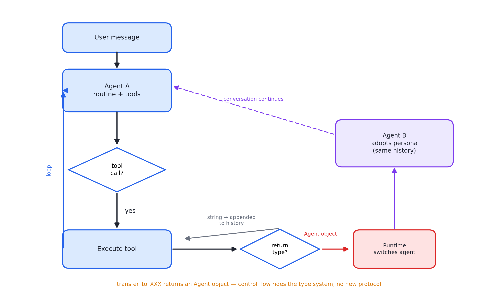
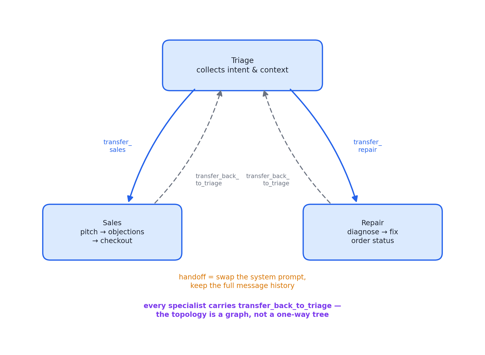

# 述评 10 | Orchestrating Agents: Routines and Handoffs（OpenAI，2024-11）

> OpenAI (2024). *Orchestrating Agents: Routines and Handoffs*. OpenAI Cookbook（配套样例库 Swarm，官方注明仅供概念验证、不宜直接用于生产）。全文见 [original.md](./original.md)（检索于 2026-09-12）。

## 摘要

本文以约两百行 Python 代码给出多智能体编排的最小可行实现，提出例程（routine，自然语言步骤与工具集的组合）与移交（handoff，一个智能体将进行中的对话连同全部历史移交给另一智能体）两个核心概念。文献不引入任何新协议，仅以对话补全接口与函数调用实现"何时换哪个智能体在场"的控制流；其移交的接口设计——移交工具返回智能体对象、由运行时检测类型并切换——以类型系统边界承载控制流转移。配套样例库 Swarm 是后来 Agents SDK 的前身。

## 1 文献定位与背景

本文发布于 2024 年 11 月（函数调用普及初期），署 OpenAI Cookbook 团队。其时多智能体框架开始堆叠概念，本文的立场相反：不发明新协议，以最朴素的循环与函数调用把"换人"机制实现出来。

在文献群中，本文是第三组（编排与多智能体）中最早期的一篇：它是 [02 号述评](../02-openai-practical-guide-building-agents/commentary.md)所评指南中 Decentralized 模式的代码原型；样例库 Swarm 后演化为 Agents SDK（[11 号述评](../11-openai-agents-sdk/commentary.md)所评对象），移交由此成为平台级原语。本书第 07、16 章的相关论述以本文为先声。

## 2 核心命题与贡献

### 2.1 例程与执行循环

**例程**即"自然语言指令（以系统提示承载）加完成步骤所需的工具集"，用以刻画一组步骤。示例客服流程含条件分支：先追问、再提方案、仅在不满意时退款、查询条目、执行退款。作者指出其关键性质：大语言模型（Large Language Model, LLM）对中小型分支流程的处理相当稳定，且具备"软"遵循——模型能自然引导对话绕开死胡同，不会如状态机般卡死于未定义转移。这一"软状态机"观察是后来"以提示代替流程图"论述的源头。

**执行循环**：run_full_turn 以 while 循环实现——获取模型响应、执行工具调用、将结果以工具角色消息写回历史、直至响应不含工具调用为止。工具模式由辅助函数从 Python 函数签名与 docstring 自动生成——"docstring 即工具描述"的行业惯例由此发端。

### 2.2 移交的类型化接口设计

图 10.1 · run_full_turn 循环与移交的类型切换：控制流搭乘工具返回值的类型系统，无需新协议

**移交**的定义：智能体将进行中的对话移交给另一智能体，后者完全接手且携带全部对话历史——类比电话转接，但接手者读过了全部通话记录。

**移交函数的接口设计**：为智能体提供 transfer_to_XXX 形态的工具，由模型自行判断调用时机；被调时返回的不是字符串而是 Agent 对象——运行时检测返回类型并切换当前智能体，同时注入一句"Transfered to XXX. Adopt persona immediately."（原文拼写如此）。以类型系统的边界承载控制流转移、无需新增消息类型或协议，是全文最优雅的设计。

### 2.3 三智能体拓扑与双向移交

图 10.2 · 分诊-销售-维修三智能体拓扑：双向移交使拓扑成为图而非单向树

分诊、销售、问题与维修三个智能体演示了完整的客服拓扑：分诊收集信息后按意图转接；各专职智能体均携带 transfer_back_to_triage（用户提及职责外话题即转回）——双向移交使智能体拓扑成为图而非单向树。销售智能体的提示是一段完整的业务流程，示范了例程承载领域流程的写法。

### 2.4 交接的上下文语义：换提示不换历史

交接时系统提示被替换为新智能体的指令，但消息历史全量保留——"换提示不换记忆"。该取舍后来在 [02 号述评](../02-openai-practical-guide-building-agents/commentary.md)所评指南中被形式化为 Manager（中央保留上下文）与 Decentralized（上下文随控制权转移）两种拓扑的分水岭。

## 3 机制与方法的评述

- **最小实现的教学价值**：全部机制（循环、模式生成、类型切换）在两百行内可见；剥离框架包装后，多智能体编排的实质——控制流在提示、数据流在消息历史——变得可直接检验；
- **"软状态机"的性质判断具有前瞻性**：它在结构化流程（硬编码状态机）与自由对话（不可控）之间指出了第三条道路，本书第 09 章多种模式的可行性均以此为基础；
- **移交的类型化设计与 04 号"工具返回高信号"原则同构**（见 [04 号述评](../04-anthropic-writing-effective-tools/commentary.md)）：控制流信息本身就是工具的返回值，无需旁路协议；
- **双向移交使智能体拓扑可成环**，区别于主从树——这为后来 Manager 与 Decentralized 的谱系划分埋下伏笔。

## 4 局限与批判性讨论

- **规模边界未量化**：例程"中小型分支"的适用上限没有数据支撑，多少工具、多少分支开始退化，只能由使用者自行试验；
- **移交语义存在隐性代价**：历史全量继承在跨域场景（分诊转维修）符合直觉，但历史中充斥前序智能体的工具调用细节，新智能体的有效上下文因此被压缩——该代价未被讨论；
- **Swarm 被官方明确标注不宜用于生产**（无状态管理、无护栏、无评测），本文的价值在概念而非工程完备性；将机制直接迁移到生产会留下安全与可靠性缺口；
- **无鉴权与权限模型**：任何智能体可调用移交工具转接至任何其他智能体，恶意提示可诱导越权移交——该攻击面在文中未出现；
- **移交是串行的控制权转移而非并行分派**：与并行编排的关系未被讨论，混用两种模式需另行设计。

## 5 与相关文献及本书的关联

在文献群内部，02 号（Decentralized 模式的指南化）、11 号（Swarm 的产品化）、08 号（并行编排的对照面）、09 号（无编排自治的对照面）与本文直接相关。在本书中，本文观点主要锚定于第 02、03、07、11、16、18 章：

| 本文概念 | 本书位置 | 实战册 |
|---|---|---|
| routine（SOP + 工具集） | 第 03、11 章 | stage02/03 系统提示+工具注册 |
| run_full_turn 循环 | 第 02、21 章 | stage01 主循环 |
| handoff 换提示不换历史 | 第 07、18 章（智能体间协作协议（Agent-to-Agent Protocol, A2A）任务移交的对照物） | stage05（对照：subagent 是干净上下文） |
| transfer 工具返回 Agent 对象 | 第 16 章控制流 | stage10 MCP bridge 的"工具即一切" |
| Swarm → Agents SDK | 第 06 章（框架演化史） | —— |
