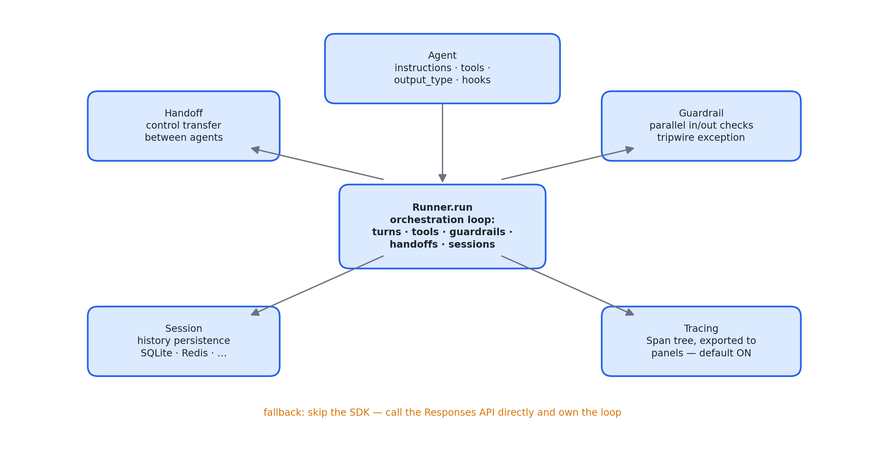
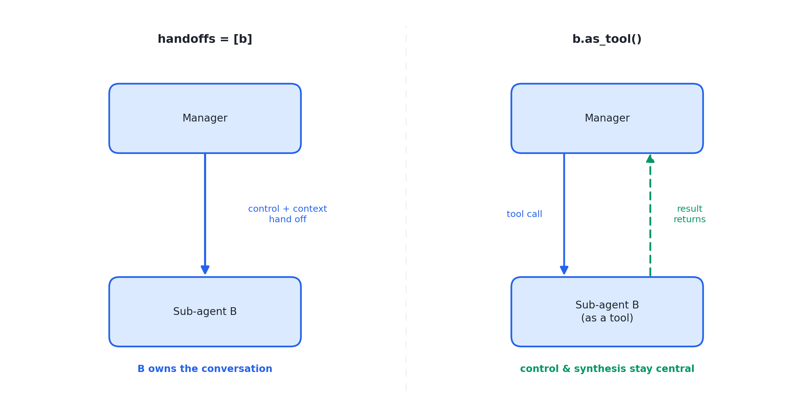

# 述评 11 | OpenAI Agents SDK — Core Concepts（OpenAI，2025-03 首发持续更新）

> OpenAI (2025). *OpenAI Agents SDK — Core Concepts*（Agents、Handoffs、Guardrails、Sessions、Tracing 五个概念页合并存档）. OpenAI 官方文档（openai.github.io/openai-agents-python/；2025-03 首发，持续更新）。全文见 [original.md](./original.md)（检索于 2026-09-12）。

## 摘要

本文档是 Swarm 概念验证库产品化之后的官方原语集：智能体（Agent）、移交（Handoff）、护栏（Guardrail）、会话（Session）、追踪（Trace）五个概念被固化为应用程序接口（Application Programming Interface, API）。文献以五个概念页合并存档的形式，展示了 OpenAI 对多智能体工程"不可约要素"的划分——编排循环与运行时归 SDK，模型调用可回落至 Responses API 自持循环。其阅读价值不在接口细节，而在原语的划分方式本身：五个原语共同构成一张多智能体系统架构的词汇表。

## 1 文献定位与背景

源文档为 OpenAI Agents SDK 官方文档，2025 年 3 月首发、持续演进；本档案检索于 2026 年 9 月，已含沙箱智能体与提示模板等较新概念。体裁为平台文档而非论文或博客——这本身即是范式成熟度的信号：工程范式被 SDK 固化为产品接口。

在文献群中，本文是第三组（编排与多智能体）的收官文献：它是 [10 号述评](../10-openai-orchestrating-agents/commentary.md)所评 Swarm 概念验证库的产品化终点，也是 [02 号述评](../02-openai-practical-guide-building-agents/commentary.md)所评指南中编排与护栏章节的平台化实现。本书实战册十二个 stage 的机制几乎都能在本文档中找到产品级对应物。

## 2 核心命题与贡献

图 11.1 · 五原语词汇表：智能体定义、控制权转移、安全校验、状态持久化、可观测性，编排循环归运行时

### 2.1 Agent 原语、依赖注入与结构化输出

智能体定义为大语言模型（Large Language Model, LLM）配置指令、工具与运行时行为（移交、护栏、结构化输出、钩子）的组合。其配置面本身即一份工程要素清单：handoff_description（被移交时向外暴露的说明）、输入/输出护栏（链路首尾两道闸）、tool_use_behavior（工具结果回灌对话还是终止运行）、reset_tool_choice（防止工具调用死循环）。文档同时明确了框架与自研的分界：SDK 负责编排（轮次、工具、护栏、移交、会话）；要自持循环则直接使用 Responses API。

**Context 为依赖注入**：任意对象随 Runner.run 传至每个智能体、工具与移交，承载依赖与运行时状态，与对话历史严格区分。会话内上下文（消息）与会话外状态（context）分属两套体系，分别对应上下文工程与工具层设计的关切。**结构化输出**以类型定义切换输出形态，将模型输出从文本升级为类型化契约——评测与下游集成的地基。

### 2.2 Handoff 原语：两种拓扑一行之差

图 11.2 · 同一子智能体的两种接法：handoffs 让控制权随上下文移交，as_tool() 让控制权留在中央

配置移交目标的子智能体接收完整对话历史并接管会话；Manager 模式则以 as_tool() 将子智能体变为工具、控制权留在中央。两种模式仅差一处配置（handoffs 列表或工具列表）——10 号文献的概念被压缩为一行配置。

### 2.3 Guardrail 原语：乐观执行的运行时化

并行运行的输入/输出校验器（可为函数或独立智能体），违约即触发 tripwire 异常中断运行——02 号指南所述"乐观执行"的正式化。默认并行而非串行阻塞，体现"护栏不拖慢主流程"的工程取向。

### 2.4 Session、Tracing 与生命周期钩子

**Session 原语**：自动维护对话历史，后端涵盖内存、SQLite、Redis、SQLAlchemy、MongoDB 等；支持历史与新输入的合并控制、检索条数限制、记忆操作（含 pop_item 修正）、会话分支与加密，并提供对接 OpenAI Conversations API 及自动压缩的会话实现。"会话状态持久化"从各家的自定义胶水变为标准件。

**Tracing 原语**：默认开启的执行轨迹——LLM 调用、工具调用、移交、护栏均记录为 Span 树，可导出至第三方面板；文档同时给出敏感数据脱敏与自定义处理器的扩展点。"可观测"被确立为默认而非可选项。

**动态指令与生命周期钩子**：指令可为接收 context 的回调（个性化系统提示）；钩子提供智能体级生命周期回调。新增的沙箱智能体与 manifest 概念（工作区隔离、能力声明）显示平台正向"受控自治"方向继续演进。

## 3 机制与方法的评述

- **五原语的划分是一份隐性的架构判断**：多智能体工程的不可约要素被认定为智能体定义、控制权转移、安全校验、状态持久化与可观测性五类，其余（编排拓扑、提示策略）皆为其组合或配置——这为架构评审提供了可操作的词汇表；
- **"乐观执行"从描述性建议升格为运行时语义**（tripwire 异常）：护栏与主循环的并发关系被产品固定，说明该取向已经过充分验证；
- **Session 原语的演进轨迹**：从简单历史存储到合并控制、分支、加密与自动压缩，会话管理的复杂度正被平台持续吸纳——与 [03 号述评](../03-anthropic-context-engineering/commentary.md)所评的压缩技术构成"方法论产品化"的呼应；
- **默认开启的追踪将可观测性确立为行业基线**：Span 树的导出接口同时为生态（第三方面板）留出扩展位置，体现平台与生态的双向设计。

## 4 局限与批判性讨论

- **平台绑定**：原语语义与 OpenAI 生态深度耦合，第三方模型的兼容依赖社区适配层，支持程度不对称；
- **文档体裁决定证据形态**：无基准数据、无失败案例，原语合理性的论证是设计哲学式的而非实证的；
- **五原语的完备性可质疑**：知识管理（技能、检索）与长期记忆未进入原语集，说明该划分反映 2025 年初的问题空间；其后沙箱、manifest 等概念以追加形式出现，划分的稳定性有待观察；
- **乐观执行在长任务中的失效恢复**：异常后的状态回滚依赖使用者自行处理，文档未给出事务性保障；
- **"API 即教学"的双刃性**：配置面的便利使关键机制（如 reset_tool_choice 防死循环）成为默认开关而非显式设计环节，使用者可能在未理解机制的情况下依赖默认值。

## 5 与相关文献及本书的关联

在文献群内部，10 号（前身与概念来源）、02 号（编排与护栏的平台化）、07 号（提示区块与参数的平台对应）、08 与 13 号（判分与可观测的对照）与本文直接相关。在本书中，本文观点主要锚定于第 03、07、16、19、21、23、24、25 章：

| SDK 原语 | 本书位置 | 实战册 |
|---|---|---|
| Agent（instructions/tools/output_type） | 第 03、21 章 | stage02 工具、stage03 schema |
| Handoff | 第 07、16 章 | 10 号文献同款控制流 |
| Guardrail（tripwire 并行） | 第 23 章四级防线 | stage07 |
| Session | 第 25 章会话持久化 | stage09 |
| Tracing（默认 Span 树） | 第 24 章可观测三支柱 | stage08 Tracer |
| reset_tool_choice 防死循环 | 第 19 章 | stage06 stall 检测 |
