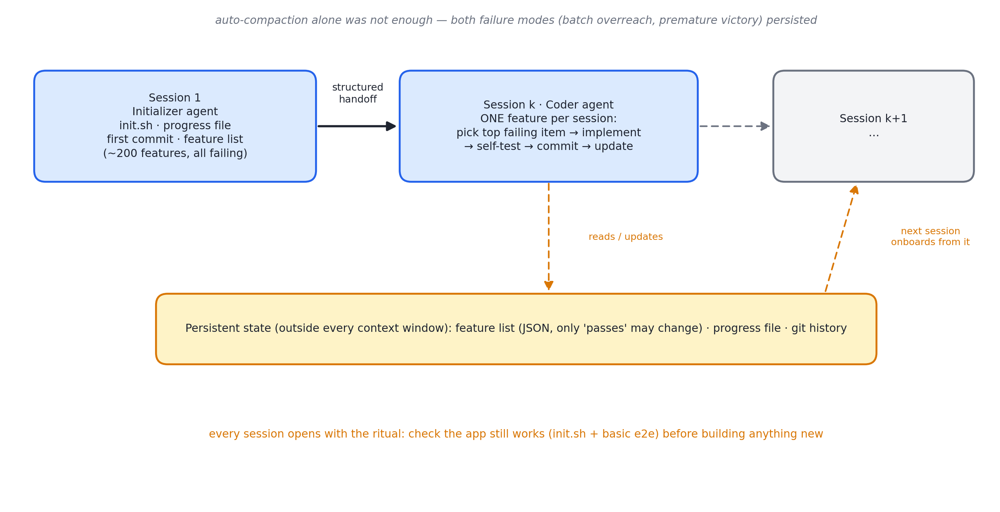

# 述评 12 | Effective Harnesses for Long-Running Agents（Anthropic，2025-11）

> Young, J. (2025). *Effective Harnesses for Long-Running Agents*. Anthropic Engineering Blog. 全文见 [original.md](./original.md)（检索于 2026-09-12）。

## 摘要

本文研究长时程智能体的核心难题：任务必须跨多个上下文窗口推进，而每个新窗口不携带前一窗口的记忆。作者将问题类比为"由互不知情的轮班工程师组成的项目组"，提出双重方案——初始化者智能体在首个会话搭建环境（含不可篡改的功能清单、进度文件与初始提交），编码者智能体在每个后续会话做增量进展并留下结构化交接物。以"克隆 claude.ai"为试验任务的内部实验表明，仅凭前沿模型与自动压缩不足以建成生产级应用，而上述 harness 设计显著改善了跨窗口的持续交付。

## 1 文献定位与背景

本文发布于 2025 年 11 月，作者 Justin Young，配套 Claude Agent SDK（软件开发工具包（Software Development Kit, SDK））的 autonomous-coding 快速上手示例开源。在文献群中，本文是第四组（Harness 与长时程）的首篇，堪称"harness 文学"系列的开端——[13 号述评](../13-anthropic-harness-design-long-running-apps/commentary.md)所评文献是对其的对抗环升级，[14 号述评](../14-openai-harness-engineering/commentary.md)所评文献则将其思想推向组织级实践。

## 2 核心命题与贡献

### 2.1 换班失忆与自动压缩的不足

长时程智能体必须在离散会话中工作，每个新会话对先前进展零记忆；上下文窗口有限且复杂项目无法在单窗口完成，跨会话桥接机制因此成为必需。

开箱即用的前沿模型（Opus 4.5）配合压缩、仅给一句高层提示，仍无法建成生产级 web 应用。失败模式有两种：

- **一次性贪多**：试图一次实现整个应用，中途耗尽上下文，下一会话接手无文档的半成品，只能猜测着修复；
- **提前宣布胜利**：后续会话环顾四周，见到已有进度即宣告项目完成。

### 2.2 双重方案：初始化者与编码者

图 12.1 · 双重方案时序：窗口内的会话更替与窗口外的持久状态分离，交接全部经由结构化产物

- **初始化者智能体**（首个会话）：搭建环境——init.sh 启动脚本、claude-progress.txt 进度日志、首个 git 提交，以及最关键的功能清单（feature list）：将用户的初始提示扩写为二百余条端到端功能描述，全部初始标记为 failing；
- **编码者智能体**（每个后续会话）：只做增量——读 git 历史与进度文件上手、从清单挑最高优先级的未完成项、实现并自测、提交并更新进度文件。

作者以脚注说明：两者实为两个不同初始提示，系统提示、工具与 harness 完全相同——双智能体设计实为双提示设计。

### 2.3 功能清单的防篡改工程

以 JSON（JavaScript Object Notation）而非 Markdown 承载——实验发现模型较不容易不当改写 JSON；仅允许修改 passes 字段；以强措辞禁止删除或修改测试。其本质是将验收标准从提示中抽出、固化为数据，使其免受上下文压缩的损耗。

### 2.4 增量纪律、端到端验证与上手仪式

- **增量与干净状态**：一次只做一个功能；每项变更附描述性提交信息与进度总结，使模型可用 git revert 恢复良好状态。"干净"的定义是工程化的：无重大缺陷、代码整洁有文档、新工程师可直接开工——即可合并入主分支的状态；
- **端到端测试堵漏**：模型倾向以单元测试或接口探活宣告完成，而功能级的端到端行为可能失效。显式要求以浏览器自动化工具像人类用户一样全流程验证后，性能显著改善；作者同时如实记录残余限制——视觉能力与自动化工具存在盲区（如浏览器原生弹窗不可见），相关功能缺陷率偏高；
- **上手仪式**：每个新会话的开场序列被固化为——确认工作目录、读 git 历史与进度文件、读功能清单并选题、运行 init.sh 并做基础端到端验证以确认应用未坏，之后才开始新功能：先确认没坏再开工，否则新功能只会雪上加霜。

### 2.5 失败模式对照与开放问题

四类问题到两侧行为约束的映射，可直接用作长时程 harness 的设计检查清单：

- 提前宣布胜利 → 功能清单全员 failing 起步 + 端到端验证才算完成；
- 留下烂摊子 → 一次一个功能 + 描述性提交信息；
- 过早标记完成 → 仅允许改 passes 字段 + 强措辞禁止改测试；
- 不会启动应用 → init.sh 进固化的上手仪式。

开放问题：单一通用编码智能体与多专职智能体（测试、质量保证、清理）孰优，以及本方案向科学研究、金融建模等领域的推广，作者均留为后续工作。

## 3 机制与方法的评述

- **功能清单在结构上等价于评测资产**：以数据形态存在的验收标准不随会话更替而失真，为每个新窗口提供与初始提示同源的目标定义——跨窗口的目标漂移由此被结构性阻断，与评测用例作为版本化资产的实践同构；
- **双智能体设计的实现成本近乎为零**：初始化与执行的分离以两个初始提示获得，是提示分层的最小实现；
- **"干净状态"纪律将软件工程的合并标准引入智能体会话生命周期**：git 提交因此同时承担版本控制与跨窗口交接的双重职能；
- **失败模式的二分覆盖了长时程任务的两大典型偏差**（一次性贪多与过早收敛），对照表使方案可直接复用。

## 4 局限与批判性讨论

- **验证域单一**：全部实验基于全栈 web 应用，浏览器自动化提供的端到端验证器是该方案成立的前提；缺少类似验证器的任务域能否套用，作者仅作展望；
- **功能清单的人工成本被低估**：二百条功能描述的扩写质量决定方案上限，其生成与维护成本未量化；
- **"JSON 比 Markdown 更防篡改"来自经验观察**：未报告篡改率的对照数据；
- **外部记忆的检索效率未讨论**：进度文件与 git 历史构成的外部记忆，在超长任务中需模型自行筛选相关信息；
- **单智能体与多智能体的比较被列为开放问题**：本文未提供初步数据。

## 5 与相关文献及本书的关联

在文献群内部，[03 号述评](../03-anthropic-context-engineering/commentary.md)（压缩机制的前提）、09 号（环境即验证器的极限版）、13 号（对抗环升级）、14 号（组织级实践）与本文直接相关。在本书中，本文观点主要锚定于第 12、13、21、22、24、25 章：

| 本文概念 | 本书位置 | 实战册 |
|---|---|---|
| compaction 不够，需跨窗口状态 | 第 12、25 章 | stage03 压缩 + stage09 检查点 |
| progress 文件 + git 历史 = 外部记忆 | 第 13 章三层记忆 | stage04 MEMORY.md/NOTES |
| feature list 不可篡改 | 第 22 章评测资产 | stage11 cases YAML + --gate |
| 干净状态（可合并）纪律 | 第 24 章可靠性 | stage09 原子检查点 |
| 开场上手仪式 | 第 21 章 agent loop | stage01 会话启动 |
| 初始化者/编码者双 prompt | 第 21 章系统提示分层 | stage05 任务包 = 子 agent 的"初始化" |
