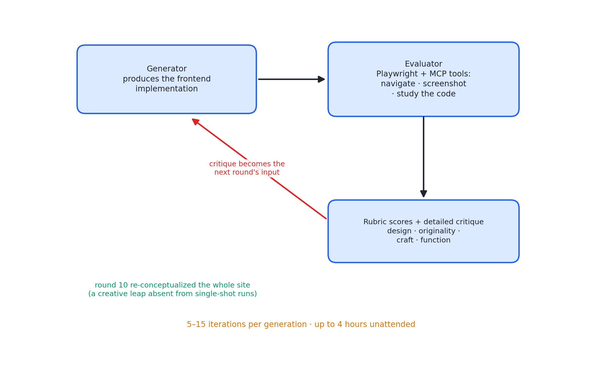
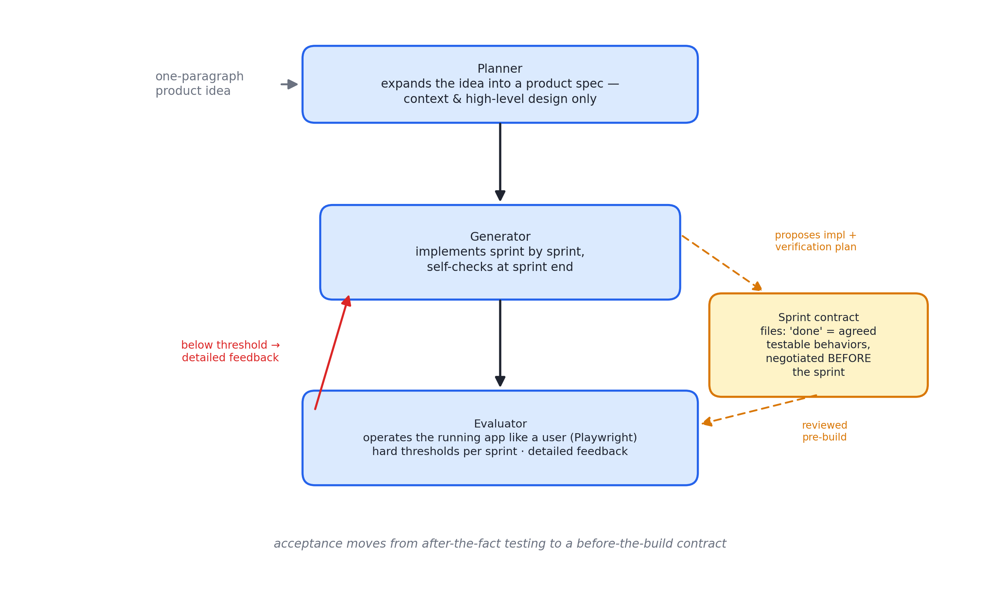
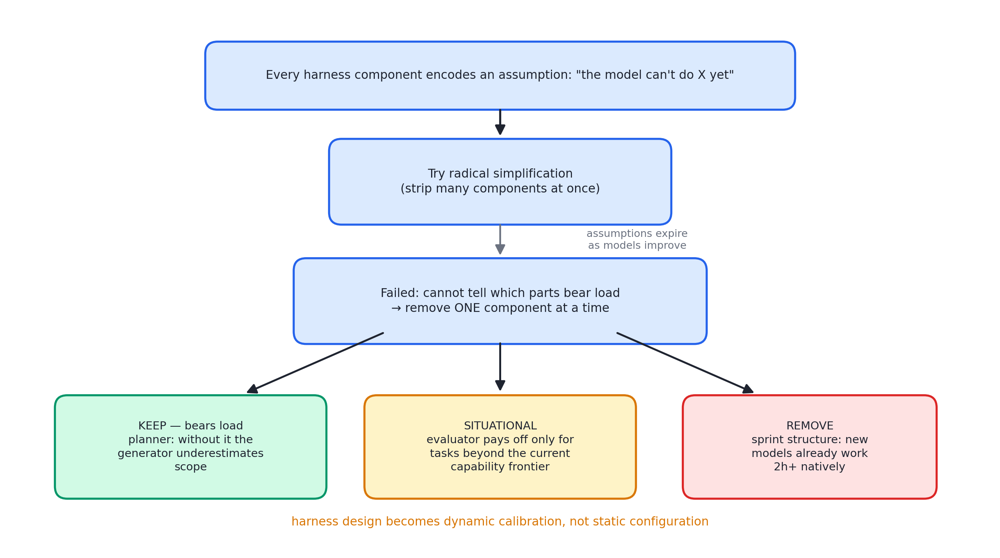

# 述评 13 | Harness Design for Long-Running Application Development（Anthropic，2026-03）

> Rajasekaran, P. (2026). *Harness Design for Long-Running Application Development*. Anthropic Engineering Blog. 全文见 [original.md](./original.md)（检索于 2026-09-12；原文含两处演示视频，静态存档以说明行代替）。

## 摘要

本文是 [12 号述评](../12-anthropic-effective-harnesses/commentary.md)所评长时程 harness 的续篇与升级。作者受生成对抗网络（Generative Adversarial Network, GAN）启发，将生成者与评估者的对抗结构引入智能体 harness：先在前端设计域证明"主观品味"可经操作化判据变为可评分项，再将该模式扩展至全栈开发，形成规划者、生成者、评估者三智能体架构，在数小时无人在环的会话中产出可用的全栈应用。文献后半部分提出"拆 harness"方法论——harness 的每个组件都是关于模型能力边界的一项假设，须随模型升级逐件检验其承重性。

## 1 文献定位与背景

本文发布于 2026 年 3 月，作者 Prithvi Rajasekaran（Anthropic Labs）。作者此前的两项工作——前端设计技能与长时程编码 harness——分别撞上两块天花板：主观质量无法自动判分，长任务随上下文填充而跑偏。本文以横跨两个域（主观品味主导的前端设计、可验证性主导的全栈开发）的通用方法回答两个问题。

在文献群中，本文属第四组（Harness 与长时程）核心：上承 12 号（继承增量推进与结构化交接两项原则），下启 [14 号述评](../14-openai-harness-engineering/commentary.md)所评组织级实践（拆 harness 思想的组织化）。

## 2 核心命题与贡献

### 2.1 两个被命名的新失败模式

- **上下文焦虑（context anxiety）**：模型在自以为接近上下文上限时开始提前收尾。整窗重置（context reset——清空上下文并以结构化交接物重启）与压缩的区别由此被阐明：压缩保留连续性但不提供干净状态，焦虑仍在；重置提供干净状态，代价是交接物必须携带足够状态。实验中 Sonnet 4.5 的焦虑强到必须采用重置，Opus 4.5 起大幅缓解；
- **自我评价宽容**：智能体评审自己的产出时，倾向自信地称赞平庸之作。解法不是以提示告诫其严格，而是**将执行与评判分离**——调教一个独立评估器变得挑剔，远比令生成者自我批判可行；有了外部反馈，生成者才有具体的迭代靶子。

### 2.2 主观质量的可评化：前端实验

四条评分判据：设计质量（整体感与识别度）、原创性（是否存在定制决策，还是模板与"AI 味"的组合）、工艺（排版、间距、对比度的技术功力）、功能性（可用性）。权重设计是方法论要点：作者刻意加重设计与原创性并显式惩罚通用化模式（如白卡片加紫渐变），因为工艺与功能性是模型默认即可得分的项。评估器以带分项打分的少样本示例校准，以减少迭代间的分数漂移。

一条深刻教训：**判据措辞直接塑造输出气质**——"最好的设计是博物馆级"使输出收敛向特定风格。判据设计本身是生成过程的一部分。

### 2.3 对抗环与三智能体全栈架构

图 13.1 · 前端域的对抗环：评估器实际操作页面并按判据打分，批评文本回流为下一轮输入

图 13.2 · 全栈三智能体：规划者防规格错误级联，冲刺契约把验收前移为事前协商

**前端对抗环**：生成者产出前端实现 → 评估者经 Playwright 与模型上下文协议（Model Context Protocol, MCP）工具实际导航页面、截图、研究实现，再按判据打分并撰写详细批评 → 反馈回流为下一轮输入。每代五至十五轮迭代，全程最长四小时。荷兰美术馆网站案例中，第十轮彻底推翻既有方案，将其重构为三维展厅的空间体验——这是单次生成中未曾出现过的创意跳跃。作者同时记录非线性现象：部分中间迭代优于最终版；实现复杂度随轮次上升。

**全栈三智能体**：

- **规划者（Planner）**：将一至四句的初始提示扩写为完整产品规格，刻意只写产品语境与高层设计、不写细粒度实现，以防规格错误级联进下游；并被要求策划人工智能功能点；
- **生成者（Generator）**：以冲刺（sprint）为单位逐功能实现，冲刺末自评后交验；
- **评估者（Evaluator）**：以 Playwright 像用户一样操作运行中的应用，检验界面、接口与数据库状态，按带硬阈值的判据逐冲刺评分，不达标即出具详细反馈。

### 2.4 冲刺契约与对比数据

**冲刺契约**：每个冲刺开始前，生成者与评估者以文件互写的方式谈成"完成"的定义与可测行为——生成者提出实现方案与验证方式，评估者审查其是否在建造正确的东西。验收标准由事后检验前移为事前契约，是 12 号功能清单的对话化升级；文件互写的谈判通道保持了架构的简单性。

**对比数据**（复古游戏制作器任务）：

| 配置 | 耗时 | 成本 | 结果 |
|---|---|---|---|
| 单智能体 | 二十分钟 | 九美元 | 外观可看，核心玩法失效（实体不响应输入） |
| 全 harness | 六小时 | 二百美元 | 十六项功能规格、含内置 AI 辅助、游戏可玩 |

二十倍成本买到的是"核心功能真的能用"。评估器发现的问题精确到具体文件行号的条件逻辑错误与接口路由顺序缺陷。评估器本身亦经数轮调优：开箱的模型会找出真问题后说服自己放行、测试浮于表面；调优回路为"读评估日志、定位判断分歧、修改评估提示"——评估器自身成为被评测的对象，属元评测实践。

### 2.5 拆 harness：逐件承重测试

harness 的每个组件都是"模型自身做不到某事"这一假设的编码；假设可能错误，且随模型进步而过期。激进简化失败（无法辨别哪些件承重）后，改用逐件移除法。具体发现：

图 13.3 · 拆 harness 程序：激进简化失败后逐件移除，按承重性决定去留

- **冲刺结构可拆**：新一代模型原生能连续工作两小时以上；
- **规划者不可拆**：缺失时生成者会低估范围；
- **评估器的价值取决于任务相对模型能力边界的位置**：边界内的任务是纯开销，边界外仍有真实增益——"是否使用评估器"是按任务定位的决策而非固定开关。

数字音频工作站案例（约四小时一百二十四美元，构建阶段连贯运行两小时以上）验证了简化未降低质量。前瞻：模型进步时部分问题会"自行解决"，但 harness 的有趣组合空间不会缩小、只会移动——持续寻找下一个新颖组合是智能体工程师的长期工作。这是对 01 号"最简单方案优先"信条在 2026 年的更新表述。

## 3 机制与方法的评述

- **对抗结构的监督信号移植**：生成者-评估者结构把对抗训练的监督信号思想移到推理时——评估器不是事后裁判而是迭代驱动器；判据的措辞被证明参与塑造输出的风格收敛，判据设计本身是生成过程的一部分；
- **冲刺契约弥合规格与实现的鸿沟**：验收标准前移为事前协商，文件互写的谈判通道保持了架构简单性；
- **拆 harness 提供了可复用的操作程序**：先激进简化、失败后逐件承重测试，并把"是否保留组件"转化为任务相对能力边界位置的函数——harness 设计由静态配置变为动态校准；
- **代价的坦承**：对比实验同时呈现质量差与成本差，在同类文献中少见。

## 4 局限与批判性讨论

- **对比实验为单任务单次运行**：六小时二百美元对二十分钟九美元的对照无重复试验与方差报告；"质量差异显著"的判定依赖作者个人评审；
- **评估器判据的循环**：判据与调优由单一作者完成，其判断作为金标准未经独立验证，"作者认可的评分水平"存在循环；
- **三智能体架构的收益分解不完全**：规划者与评估者的独立贡献在简化实验中部分厘清，交互效应未系统测量；
- **主观判据的外推有效性未知**：判据由单一作者制定并校准，向其他审美偏好外推的有效性未知；
- **拆 harness 的结论绑定模型代际**：方法可迁移而结论有时效性——作者对此有自觉声明。

## 5 与相关文献及本书的关联

在文献群内部，12 号（直接前作）、[03 号述评](../03-anthropic-context-engineering/commentary.md)（上下文焦虑与重置的机制背景）、08 号（评估器与判分方法学）、09 号（环境压测的同源思路）、14 号（拆 harness 的组织化）与本文直接相关。在本书中，本文观点主要锚定于第 12、16、20、21、22 章：

| 本文概念 | 本书位置 | 实战册 |
|---|---|---|
| generator-evaluator 对抗环 | 第 20、22 章模型裁判 | stage11 异族裁判 |
| sprint contract（验收契约） | 第 22 章 | stage11 rubric |
| context reset vs compaction | 第 12 章 | stage03（压缩）/stage09（重启动） |
| 评估器的元评测与调优 | 第 22 章 | stage11 judge 提示迭代 |
| 拆 harness / 承重测试 | 第 21 章七层的取舍 | stage12 逐层开关 |
| planner 防级联错误的抽象层级 | 第 16 章任务分解 | stage05 任务包 |
