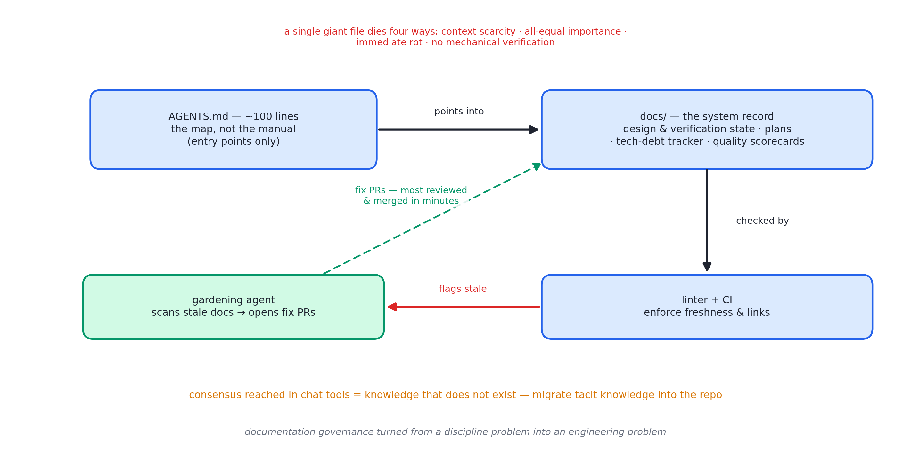
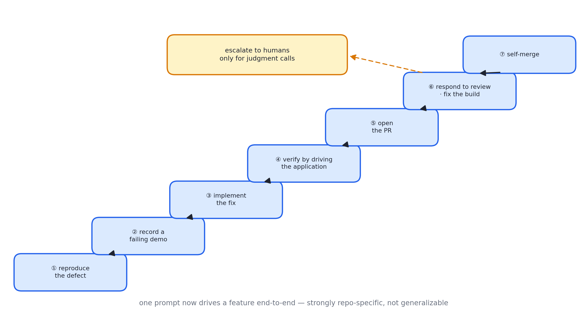

# 述评 14 | Harness Engineering: Leveraging Codex in an Agent-First World（OpenAI，2026-02）

> Lopopolo, R. (2026). *Harness Engineering: Leveraging Codex in an Agent-First World*. OpenAI Engineering Blog. 全文见 [original.md](./original.md)（检索于 2026-09-12）。

## 摘要

本文报告 OpenAI 一支工程团队的组织级实验：以"零行手写代码"为约束，由三名（后增至七名）工程师驱动 Codex 智能体，在五个月内构建约百万行规模、拥有真实日活用户的软件产品，合并约一千五百个拉取请求（Pull Request, PR）。作者的核心命题是：当智能体承担全部编码，工程师的职能转变为设计环境、表达意图与构建反馈回路，人的时间与注意力成为唯一稀缺资源。文献系统阐述了支撑该实验的 harness 工程：知识库的目录化与机械化保鲜、应用与可观测性对智能体的可读化、机械强制的架构不变量、以吞吐量重设的合并哲学，以及持续清理智能体生成漂移的"垃圾回收"机制。

## 1 文献定位与背景

本文发布于 2026 年 2 月，作者 Ryan Lopopolo（OpenAI 技术成员）。实验自 2025 年 8 月空仓库的首笔提交开始——初始脚手架乃至指导智能体工作方式的 AGENTS.md 文件本身均由 Codex 生成。零手写约束是刻意选择的：数周内交付百万行级产品的时间压力，迫使团队将全部精力投向"让智能体可靠工作"的环境建设。

在文献群中，本文是第四组（Harness 与长时程）的收官之作：与 [13 号述评](../13-anthropic-harness-design-long-running-apps/commentary.md)所评文献分别代表 harness 工程的组织侧与技术侧。本书第 21 章的七层 harness 叙事，在本报告中获得工业规模的实证。

## 2 核心命题与贡献

### 2.1 工程师角色重定义

早期进展迟缓的原因不是模型能力不足，而是环境欠规格——缺工具、缺抽象、缺内部结构。工程工作转为深度优先的赋能：将大目标拆为积木（设计、编码、评审、测试），令智能体构造积木，再以积木解锁更复杂的任务。故障处理的标准动作不是"重试"，而是追问："缺了什么能力？如何使其对智能体可读（legible）且可强制（enforceable）？"人机交互几乎全部经由提示完成；评审也逐步转移为智能体对智能体。

### 2.2 应用可读性

吞吐上升后，瓶颈移至人类质量保证能力；解法是让应用本体对智能体可读：

- 应用可按 git 工作树逐一启动（每个变更一个实例）；
- 接入浏览器调试协议与 DOM 快照、截图技能；
- 日志与指标经本地可观测栈（每个工作树一份、任务完成即销毁）以查询语言暴露。

由此，"确保服务启动低于 800 毫秒"一类提示成为可执行目标。单次智能体运行可连续工作六小时以上。

### 2.3 仓库知识即系统记录

图 14.1 · "地图而非说明书"：百行入口文件 + 目录化 docs/，linter/CI 强制时效，园艺智能体持续修复

这是全文对上下文工程最具传播力的贡献："给智能体地图，而非千页说明书。"单一巨型说明文件有四项根本缺陷：

- 上下文稀缺（巨文件挤占任务与代码）；
- 全都重要等于全不重要；
- 立即腐烂（过期规则堆积且无从甄别）；
- 无法机械化校验。

替代方案：约一百行的入口文件仅作目录，结构化文档目录承载系统记录（设计文档与验证状态、执行计划与技术债追踪、质量评分表），以 linter 与持续集成强制知识库的时效与互链，常驻的"文档园艺"智能体扫描陈旧文档并发起修复 PR——知识库本身被当作代码维护。这是 [05 号述评](../05-anthropic-agent-skills/commentary.md)所评渐进式披露思想的仓库级实现。

配套立场是**智能体可读性优先**：智能体视角下，运行时取不到的知识等于不存在——聊天工具中达成的架构共识与不存在无异。因此持续将隐性知识迁入仓库；技术选型偏好"无聊"的技术（组合性好、接口稳定、训练语料覆盖充分），宁可让智能体重写一个带全量测试覆盖的并发工具，也不围绕行为不透明的第三方库做变通。

### 2.4 强制不变量与吞吐合并哲学

机械强制"在边界解析数据形状"一类不变量，不规定实现方式。架构为刚性分层（类型、配置、仓库、服务、运行时、界面，依赖方向受限，横切关注经单一入口进入），以自定义 linter 与结构测试强制，且 linter 的报错信息直接注入修复指令。此类架构在人类团队中通常推迟至数百人规模才建设，对智能体团队却是早期先决条件：约束是"有速度而无腐化"的前提。治理哲学近似大型平台组织：中央管边界，本地给自由；产出不必符合人类风格，正确、可维护、对后续智能体可读即达标。

吞吐改变合并哲学：最小阻塞的合并门、短生命周期的 PR、不稳定测试以后续运行消化而非无限阻塞——当智能体吞吐远超人类注意力，纠正是便宜的、等待是昂贵的。作者明言该哲学在低吞吐环境中是不负责任的。

### 2.5 熵与垃圾回收

全新问题随之出现：智能体会复制仓库中既有的不良模式，漂移不可避免。人工清理（每周固定两成工时）不可扩展；解法是将"黄金原则"编码进仓库并运行周期性后台清理任务（扫描偏离、更新质量评分、发起定向重构 PR，多数一分钟内可审并可自动合并）——技术债以小额持续偿还，如同为代码库做垃圾收集。人类品味被一次性捕获，然后在每一行新代码上持续执行。

### 2.6 自治阶梯与诚实边界

图 14.2 · 单提示端到端驱动一个新功能的完整阶梯，仅在需要判断处升级人类

仓库最终跨过门槛：单个提示可端到端驱动一个新功能——复现缺陷、录制失败演示、修复、驱动应用验证、开启 PR、回应评审、修复构建、仅在需要判断时升级人类、自行合并。作者谨慎声明：该行为强依赖本仓库的特定结构与投入，不可想当然推广。未知亦有坦诚：纯智能体生成系统的多年演化路径、人类判断的最大杠杆点，仍在探索。全文以一句概括收束："纪律没有消失，而是从代码转移到了脚手架。"

## 3 机制与方法的评述

- **"零行手写"约束具有实验设计价值**：它排除了人机混合开发的中间态，使 harness 各组件的贡献可被干净观察——"环境欠规格即进展停滞"的因果链因此显影；
- **知识库目录化将三层披露原则延伸到团队规模**：并以机械化校验（linter、持续集成、园艺智能体）处理文档腐烂这一长期无解问题——文档治理由纪律问题改造为工程问题，是本文最具移植性的贡献；
- **"可读且可强制"的双重标准为环境设计给出可操作判据**：仅可读而不可强制的知识会退化为建议，仅强制而不可读的约束难以演进；
- **垃圾回收机制承认智能体系统的熵增本性并以持续小额偿还应对**：与 13 号"组件编码假设、假设随模型过期"的论断构成运维侧呼应。

## 4 局限与批判性讨论

- **证据为单案例自述**：百万行、约一千五百个 PR、十分之一工时均为团队内部估计，无外部审计或对照基线；产品规模与复杂度未知，结论外推受限——作者对不普遍适用有部分自觉声明；
- **"零手写"的界定依赖申报诚实**：由人逐字口述或近乎手写的灰色地带无从核查；
- **质量评估缺独立维度**：日活用户与吞吐数据不构成缺陷率或可维护性的证据；质量评分由智能体生成并自评，存在循环风险；
- **激进合并哲学以失败成本低为前提**：而该前提依赖完整的机械校验与可回滚部署——文中以投入清单描述，未以事故数据验证；
- **人类判断的杠杆点仍未解**：作者自认这是该方法论的核心未完成部分——何种决策应保留给人、如何编码使其复利，尚未形成可传授的规程。

## 5 与相关文献及本书的关联

在文献群内部，05 号（渐进式披露的仓库级实现）、[06 号述评](../06-anthropic-claude-code-best-practices/commentary.md)（环境配置思想的重型化）、13 号（拆 harness 的技术侧对偶）、09 号（自治极限的另一路径）与本文直接相关。在本书中，本文观点主要锚定于第 11、14、21、22、23、24 章：

| 本文概念 | 本书位置 | 实战册 |
|---|---|---|
| 地图而非说明书（100 行 AGENTS.md + docs/） | 第 11、14 章 | stage03 宪法区 + stage10 渐进披露 |
| 机械强制的架构不变量 | 第 11 章源头截断 | stage07 黑名单/权限的"架构版" |
| 应用可读性（worktree 实例/日志指标入 agent） | 第 24 章可观测 | stage08 Span/JSONL |
| golden principles + 后台清理 agent | 第 22 章回归 | stage11 CI 门槛 |
| 自治阶梯与"判断时升级人类" | 第 23 章人在环 | stage06 确认门 |
| 纪律从代码移到脚手架 | 第 21 章七层 harness | stage12 capstone |
